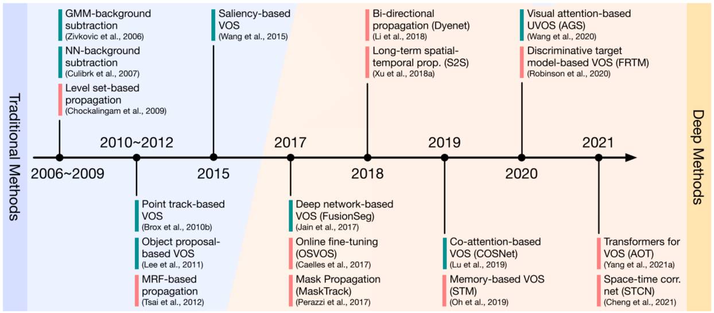

# Ch02 背景

在Sec2.1中，我们简要地回顾了VOS领域的历史背景。在Sec2.2中，介绍了语义图像分割的主要原理和代表性方法。在Sec2.3中，总结了近期VOS方法的基本架构。图3展示了VOS领域里程碑式的工作。

图3. VOS方法的简要年表，其中2006年至2021年的一些里程碑式的工作被高亮显示。绿色标记：无监督VOS方法；红色标记：半监督VOS方法。关于传统方法的更多细节参考Sec2.1，而深度方法讨论参考Ch04。

## Sec2.1 VOS的历史背景

**VOS的早期尝试**[^Chien,2002],[^Kim&Hwang,2002]主要集中在从视频序列中提取移动的对象，这是一些多媒体应用中的关键操作，例如：基于内容的视频编码[^Sikora,1997]。**背景减法**是这些方法中最常使用的方法，其主要步骤如下：⑴用连续帧之间的差异建立一个背景模型；⑵通过从当前帧中减去背景来提取分割的结果。在早期的方法中，背景模型大多来自像素值或者滤波结果。为了进一步提高复杂场景下的鲁棒性，一些统计学技术（例如：高斯混合模型[^Zivkovic&VanDerHeijden,2006]和神经网络[^Culibrk,2007]）也被用于背景建模。

随着用于对象建议生成方法[^Endres&Hoiem,2010]的成功，基于**对象建议**（Object Proposals）的VOS方法[^Lee,2011][^Zhang,2013][^Ma&Latecki,2012]被开发出来用于从视频序列中分割对象，其主要步骤如下：⑴为所有视频帧生成对象建议；⑵对生成的建议进行分组和排序，以得出重复出现的对象。相比之下，基于对象建议的方法比基于背景减法的方法能处理更多的挑战性的序列（例如：复杂的背景、静态的对象）。然而，由于生成提议与分组功能的效率低下，这些方法通常都运行缓慢。因此，在随后的方法中也很少应用对象建议，并且被时空边界方法[^Papazoglou&Ferrari,2013][^Wang,2015]所取代用于估计显著对象的位置。

由于物体在视频序列中大多是平滑移动的，因此时间上的连续性在分割过程中可能是有益的。然而，早期的方法只探讨了短时连续性。为了建立帧的长时关系，开发了基于**点轨迹**（Point Trajector）[^Brox&Malik,2010b][^Ochs&Brox,2012][^Fragkiadaki,2012]的方法。其主要步骤如下：⑴基于运动信息（如：光流）建立点轨迹；⑵测量轨迹之间的关联度，并将它们进行聚类以获得分割结果。在早期的基于轨迹的方法中，关联度和聚类大多是根据轨迹的局部信息产生的，这使得最终的结果容易受到错误轨迹的影响。为了解决这个问题，在随后的方法中同时探索了轨迹的局部和全局信息[^Chen,2015b]。

除了移动对象分割的自动化方法，使用少量标注的VOS[^Zhong&Chang,1999][^Chockalingam,2009]在早期阶段也引起了一些关注，这可以被看作是早期的半监督视频对象分割（SVOS）方法。如上所述，SVOS的目标是将标注的掩膜/轮廓“传播”到剩余的帧上。在基于深度学习的方法兴起之前，SVOS的研究[^Fan,2015][^Wang,2017b]主要集中在具有判别性的特征描述器和可靠的时间对应关系上，以实现在整个序列上传播一致的信息。

## Sec2.2 语义图形分割

在大多数现有的VOS方法中，分割过程是逐帧进行的，因此基于深度学习的图像分析技术对VOS都是有益的。例如：基于深度学习的语义图像分割将每个像素划分为基于编码特征的预定义语义类别[^Garcia-Garcia,2018][^Ghosh,2019]。同样的，VOS也是一个像素级的分类任务，因此在讨论VOS方法之前也需要介绍一下图像分割的主要原理和代表性方法。

最近，卷积神经网络（CNN）在许多计算机视觉任务中表现出卓越的性能，例如：图像分类[^Krizhevsky,2012][^Simonyan&Zisserman,2015]和对象检测[^Girshick,2014][^Girshick,2015]。为了将这样的成功带到图像分割中，[^Long,2015]对原始设计用于图像分类的CNN做了一些改变，其中CNN的最后几个全连接层被全卷积层和上采样模块所取代。通过这种方式，改造后的网络被命名为全卷积网络（Fully Convolutional Layers，FCN），可以接受任意大小的输入并产生相应大小的输出。在训练过程中，FCN使用ImageNet[^Russakovsky,2015]（图像分类数据集）上预训练得到的权重初始化，然后在一个分割数据集（PASCAL[^Everingham,2012]）上进行微调。对于输入图像中的每个像素，FCN都会生成一组概率，表明该像素属于所有语义类别的可能性如何。直观地说，FCN调整了传统的CNN，从而不仅仅输出图像的类别得分，而是输入图像中的所有像素的类别得分。

由于其卓越的性能和端到端的可训练性，FCN已经成为语义图像分割网络架构的主流的技术。之后，人们提出了许多改进，大部分的变化都集中在如何将分割图的清晰度更加接近原始图像，例如：DeconvNet[^Noh,2015]、U-Net[^Ronneberger,2015]和SegNet[^Badrinarayanan,2017]。在DeepLab模型家庭中[^Chen,2015a][^Chen,2017a][^Chen,2018a]，语义图像分割的性能被提升到新的高度。为了减少分辨率的损失，提高边界定位的准确性，DeepLab的早期版本[^Chen,2015a][^Chen,2017a]就已经与膨胀卷积（Dilated Convolution）[^Yu&Koltun,2016]、空间金字塔池（Spatial Pyramid Pooling）[^He,2015]和全连接条件随机场（Conditional Random Field，CRF）[^Krahenbuhl&Koltun,2011]相结合。通过将图像级别的特征图融合到并行膨胀卷积模型中，DeepLabv3[^Chen,2017b]进一步提高了分割的精度，同时将耗时的CRF从模型中移除。在DeepLab的最新版本（v3+）[^Chen,2018a]中，Xception[^Chollet,2017]被用于特征提取的骨干网络。同时，采用了编码器——解码器结构来实现更加区域边界。虽然近年来提出了许多新的算法用于语义图像分割，但是由于其性能的稳定性，DeepLab模型仍然是VOS中最常使用的架构（参见表3、表4、表5）。有关基于深度学习语义图像分割的更多细节，请参考[^Garcia-Garcia,2018]和[^Ghosh,2019]。
