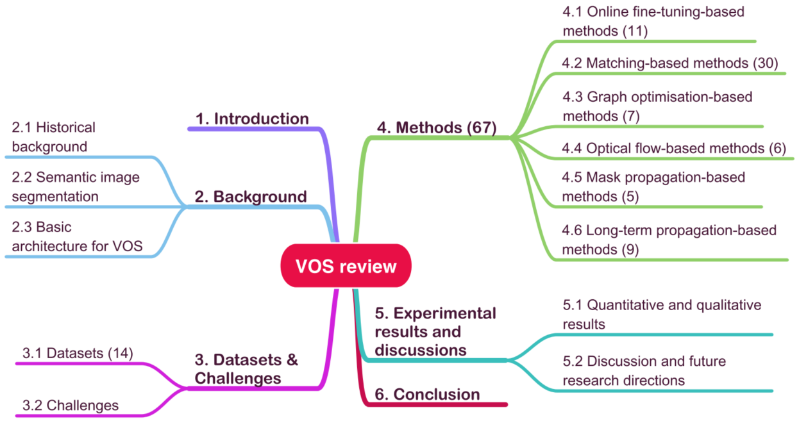

# Ch01 简介

视频对象分割（Video Object Segmentation，VOS）是将视频序列中的前景区域和背景分享的任务[^Cucchiara,2003]。与对象跟踪相似[^Yilmaz,2006]，VOS方法建立了不同帧上相同对象的对应关系，但是可以获得更多对象表示的细节（像素级的掩码，而不是边界框）。因此，VOS在许多现实世界的应用中发挥了重要作用。例如：视觉监控、动作识别、视频汇总和视频编辑[^Perazzi,2016a]。在早期基于手工制作特征的VOS方法中，对象性质[^Zhang,2013]、光流[^Papazoglou&Ferrari,2013],[^Tsai,2016]和显著性视觉[^Faktor&Irani,2014],[^Wang,2015]是经常使用的技术，用于从视频序列中分割对象。虽然这些方法在当时取得了最先进的成果，但是随着深度学习技术和高性能计算的发展，基于深度学习的VOS方法在准确性和效率方面都有了很大的进步。因此，最近的VOS方法大多是基于深度神经网络来实现的。两个权威的VOS基准给出的统计数据[^Perazzi,2016a],[^Xu,2018b]提示了当前的VOS方法的性能正在逐年提升，但是仍然未达最优。由于其潜在的应用和性能的提升空间，基于深度学习的VOS已经成为计算机视觉领域的一个活跃的研究课题。

当前的VOS方法主要分为四种类型：无监督的、半监督的、互动的和指导的（或者语言引导的）。本文重点讨论其中两种被广泛研究的类型：无监督的VOS（Unsupervised VOS, UVOS）和半监督的VOS（Semi-supervised VOS, SVOS）。注意到VOS中的“无监督”和“半监督”与一般机器学习任务有不同的应用范围。在VOS中，这些术语表示推理过程中而不是训练过程中的监督水平。特别的是，UVOS方法在没有任何基准标签或者先验知识 （非监督设置）的条件下执行分割。具有显著的运行模式或者视觉显著性的对象可以被分割出来。另一方面，SVOS方法在少数几帧内使用有效的基准标签初始化（一般只有第一帧，半监督设置）。这些标签是手工注释的，用于标记剩余帧中需要被分割的对象。为了避免概念混淆，最近的一些工作将**无监督VOS**/**半监督VOS**称为**全自动VOS**/**半自动VOS**或者**零样本VOS**/**单样本VOS**。

图1. UVOS和SVOS方法的示意图。这两种方法都以原始视频作为输入。UVOS方法针对具有主要运动模式或者视觉显著性的对象执行分割。SVOS中的目标对象（需要分割的对象）取决于第一帧（紫色边框）中的人类标注，因此其定义目标对象时更加灵活。

两种VOS之间的区别在图1中进行了描述，并且还能看出目标对象（需要分割的对象）在UVOS和SVOS中分别是自动定义和手动定义。许多早期的UVOS方法都是进行单一物体的分割，因为根据运动模式和视觉显著性很难区分对象实例。随着实例级分割模块的集成，无监督多对象分割方法也纷纷出现。

最近，出现了两篇关于视频分割的回顾类文献。[^Yao,2020]对基于手动生成特征和深度学习的视频对象分割和跟踪方法进行了很好的调研。[^Wang,2021b]则全面回顾了基于深度学习的视频对象分割和视频语义分割。与他们宽泛的研究范围不同的是，我们的论文针对基于深度学习的非监督VOS和半监督VOS方法进行更加详细的分类、回顾和验证实验，从而让读者更好地理解这些方法的机制、进展和发展趋势。因此，我们建议读者阅读上述两篇文章，以回顾交互VOS和指导（或者语言引导）VOS，还可以通过[^Wang,2021b]回顾视频语义分割方法。我们的重点是基于深度学习的无监督VOS/半监督VOS。

综上所述，我们工作的主要贡献如下：

- 针对有利于训练和评估UVOS与SVOS的数据集进行了回顾和分析。
- 将现有的UVOS和SVOS方法按照空间特征和时间特征的使用方式分成了六类，并且对它们的起源、发展历史、结构、优点与缺点，以及代表性方法进行了深入的，并且有组织地回顾。
- 通过几个基准数据集上发布的评估结果的分析和具有代表性的技术在不同类型的挑战性视频序列上执行的测试，讨论了所回顾的方法的性能。
- 总结了所回顾的方法的几个发展趋势，并且对未来可能的进展进行了预测。

图2直观地显示了本文的目录结构。本文的剩余部分结构如下：

- 第2节，描述了与VOS相关的几个背景概念，包括：语义分割和VOS方法中使用的典型网络架构。
- 第3节，引入并总结了现有的数据集、面临的挑战和评估的指标。
- 第4节，回顾了现有的基于深度学习的VOS方法，首先将这些方法根据其技术特性进行分组，然后详细讨论了这些方法的架构和贡献。
- 第5节，提供了具有代表性的VOS方法的定量和定性结果，并且对未来工作进行了预测。
- 第6节，对全文进行了总结。

图2. 本文的可视化目录。请注意，Sec3.1后面的数字表示本节讨论的数据集数量，同样的原则也适用于Ch04。请注意，有篇论文DyeNet[^Li&Loy,2018]在Ch04中出现两次（Sec4.2和Sec4.5）是因为它在基于特征匹配的VOS和基于掩码传播的VOS中都有价值。
