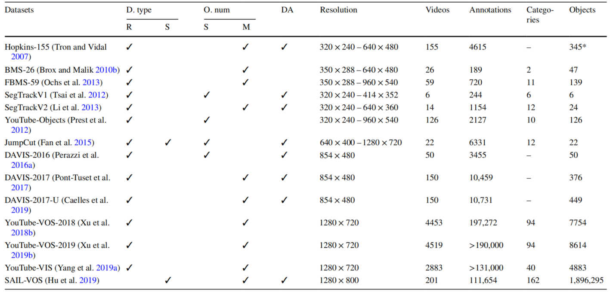
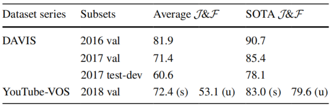
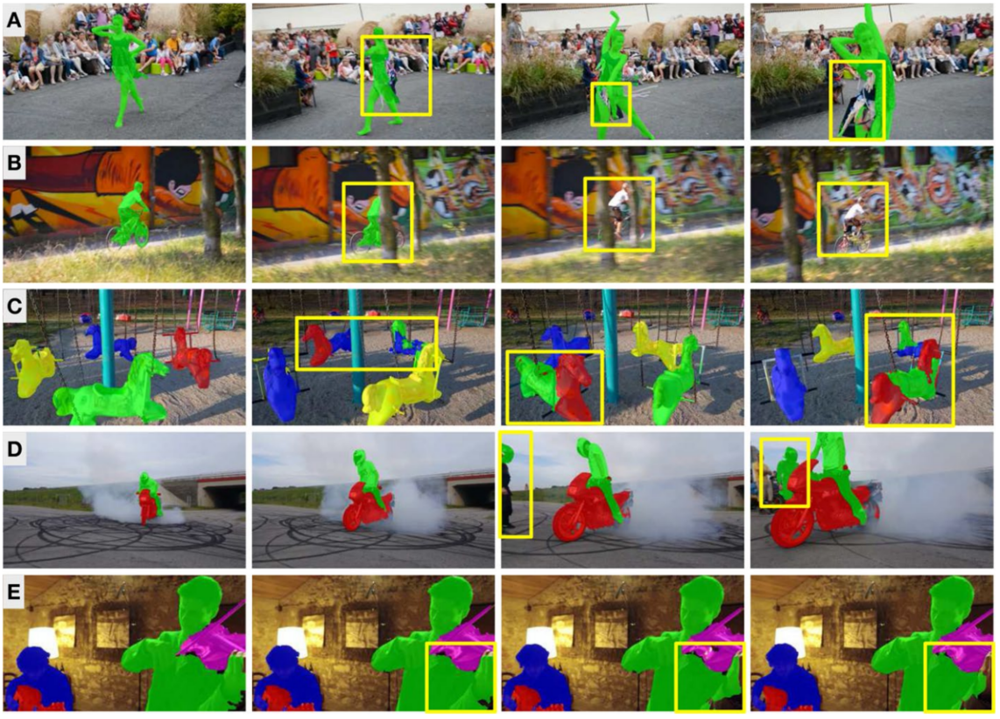
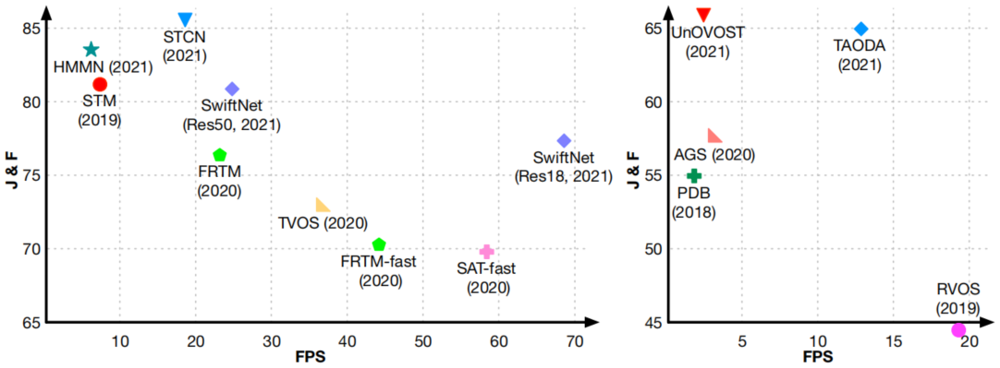

# Section 3. Datasets

考虑到深度学习系统对数据的高要求，本节浏览了现有的VOS数据集，然后是相应的评估指标和主要的挑战。

## Earlier datasets for VOS evaluation

| Years | Datasets with links                                                                |                                  Paper links                                   |
| :---: | ---------------------------------------------------------------------------------- | :----------------------------------------------------------------------------: |
| 2007  | [Hopkins 155](http://www.vision.jhu.edu/data/hopkins155/)                          |   [link](https://www.cis.jhu.edu/~rvidal/publications/cvpr07-benchmark.pdf)    |
| 2010  | [BMS-26](https://lmb.informatik.uni-freiburg.de/resources/datasets/moseg.en.html)  | [link](https://link.springer.com/content/pdf/10.1007/978-3-642-15555-0_21.pdf) |
| 2013  | [FBMS-59](https://lmb.informatik.uni-freiburg.de/resources/datasets/moseg.en.html) |              [link](https://ieeexplore.ieee.org/document/6682905)              |
| 2012  | [SegTrack v1](https://cpl.cc.gatech.edu/projects/SegTrack/)                        |      [link](http://www.bmva.org/bmvc/2010/conference/paper56/paper56.pdf)      |
| 2013  | [SegTrack v2](https://web.engr.oregonstate.edu/~lif/SegTrack2/dataset.html)        |              [link](https://ieeexplore.ieee.org/document/6751383)              |
| 2012  | [YouTube-Objects](https://vision.cs.utexas.edu/projects/videoseg/)                 |      [link](https://www.cs.utexas.edu/~grauman/papers/suyog-eccv2014.pdf)      |
| 2015  | [JumpCut](https://www.dropbox.com/s/v0v3pkrhz1vizyt/VideoSeg_dataset.rar?dl=0)     |             [link](https://dl.acm.org/doi/10.1145/2816795.2818105)             |

## :fire: Popular datasets in the deep learning era

| Years | Datasets with links                                                                          |                                                        Paper links                                                        | Remarks                                                                                                                                             |
| :---: | -------------------------------------------------------------------------------------------- | :-----------------------------------------------------------------------------------------------------------------------: | --------------------------------------------------------------------------------------------------------------------------------------------------- |
| 2016  | [DAVIS-2016](https://davischallenge.org/davis2016/code.html)                                 | [link](https://www.cv-foundation.org/openaccess/content_cvpr_2016/papers/Perazzi_A_Benchmark_Dataset_CVPR_2016_paper.pdf) | (Single object) Applicable to both Unsupervised and Semi-supervised VOS                                                                             |
| 2017  | [DAVIS-2017](https://davischallenge.org/davis2017/code.html)                                 |                                       [link](https://arxiv.org/pdf/1704.00675.pdf)                                        | (Multiple objects) Applicable to Semi-supervised VOS (Two popular subsets for evaluation: validation and test-dev. The latter is more challenging.) |
| 2019  | [DAVIS-2017-U](https://davischallenge.org/davis2017/code.html)                               |                                       [link](https://arxiv.org/pdf/1704.00675.pdf)                                        | (Multiple objects) Applicable to Unsupervised VOS methods                                                                                           |
| 2018  | [YouTube-VOS-2018](https://competitions.codalab.org/competitions/19544#participate-get-data) |                                       [link](https://arxiv.org/pdf/1809.03327.pdf)                                        | (Multiple objects) Applicable to Semi-supervised VOS (Registration is required when downloading YouTube-VOS/VIS data)                               |
| 2019  | [YouTube-VOS-2019](https://competitions.codalab.org/competitions/20127#participate-get-data) |                                       [link](https://arxiv.org/pdf/1809.03327.pdf)                                        | (Multiple objects) Applicable to Semi-supervised VOS                                                                                                |
| 2019  | [YouTube-VIS-2019](https://competitions.codalab.org/competitions/20128#participate-get_data) |                                       [link](https://arxiv.org/pdf/1905.04804.pdf)                                        | (Multiple objects) Applicable to Unsupervised VOS                                                                                                   |
| 2021  | [YouTube-VIS-2021](https://competitions.codalab.org/competitions/28988#participate-get_data) |                                       [link](https://arxiv.org/pdf/1905.04804.pdf)                                        | (Multiple objects) Applicable to Unsupervised VOS                                                                                                   |

## Useful dataset for VOS

| Years | Datasets with links                                          |                                                                         Paper links                                                                         |
| :---: | ------------------------------------------------------------ | :---------------------------------------------------------------------------------------------------------------------------------------------------------: |
| 2019  | [SAIL-VOS](http://sailvos.web.illinois.edu/_site/index.html) | [link](https://openaccess.thecvf.com/content_CVPR_2019/papers/Hu_SAIL-VOS_Semantic_Amodal_Instance_Level_Video_Object_Segmentation_-_A_CVPR_2019_paper.pdf) |

## 3.1 数据集

表1显示了14个视频数据集以及它们的主要属性。基于这些特性，我们对所列出的数据集进行了详细地讨论，特别是在挑战和适用环境方面，以指导对VOS感举的研究人员选择适当的数据集来训练和评估他们自己的方法。

表1. VOS的现有数据集汇总

### 3.1.1 Hopkins-155

这个数据集[^Tron&Vidal,2007]是为评估基于点的运动分割算法而设计的，其中每一帧视频中的一组点（39~550个点）完成了标注。所涉及的序列被分为三类：⑴棋盘：移动对象被棋盘图案所覆盖，以保证跟踪点的数量；⑵交通场景：由室外的交通场景组成；⑶有关节的/非刚性的对象：序列是由关节、脸部和行走的人组成。作为一个早期的基准，数据集为社区提供了一个评估分割方法的旋转、平移和退化运动的鲁棒性的机会。然而，考虑到标注的稀疏性和挑战的有限性，我们不鼓励使用该数据集训练和评估基于深度学习的VOS方法。

### 3.1.2 BMS系列（伯克利运行分割数据集，Berkeley Motion Segmentation Dataset）

这个数据集系列是为移动对象分割设计的，由两个版本的数据集组成：BMS-26[^Brox&Malik,2010b]和FBMS-59[^OChs,2013]（Freiburg-BMS）。BMS-26是由26个视频序列组成，其中人类和汽车是最经常使用的对象类别。FBMS-59扩展了BMS-26，将视频序列的数量增加到59个，并且涉及更多的对象类别。在这两个数据集中，都涵盖了诸如遮挡和运动模式变化等挑战，因此可以在这些数据集中评估VOS方法对它们的鲁棒性。然而，用于训练的标注数据其部分视频序列的空间分辨率较低，并且视频帧只有一个稀疏的子集进行了标注，因此仅从这些数据集中很难实现一个健壮的VOS系统。

### 3.1.3 SegTrack系列

这是一个小规模的数据集系列，设计用于视频对象的分割和跟踪，它包括两个版本的数据集：SegTrack v1[^Tsai,2012]和SegTrack v2[^Li,2013]。SegTrack v1只包含6个视频序列，但是所有帧都有像素级的掩膜标注。SegTrack v2扩展了以前的版本，增加了更多的视频序列和标注对象。两个数据集中的视频序列都具有挑战性，因为快速运动和对象变形经常出现。与BMS系列相似，SegTrack系列的视频空间分辨率也相对较低。因此，不鼓励只在这个数据集系列上训练基于深度学习的VOS方法。

### 3.1.4 YouTube-对象

这个数据集[^Prest,2012]最初是为视频对象检测而设计的，所有的视频序列（共包含57万帧）都是从互联网上下载的，被分成10个类别。为了满足VOS的需要,[^Jain&Grauman,2014]选择了一个视频帧的子集（超过2万帧），并且在每10个帧中注释了像素级掩膜。由此产生的数据集包括了126个视频序列，有2127个标注的帧，成为当时最大的VOS数据集。然而，由于其稀疏的标注和不均匀的类别分布，它并不是一个适合VOS方法训练的数据集。

### 3.1.5 JumpCut（跳跃切割）

这个数据集[^Fan,2015]由22个视频序列组成，共6331个帧，所有这些都有像素级的掩膜标注。除了在现实世界中拍摄的序列，该数据集还包括少量的动画帧。根据所涉及的对象类别（主要是人类和动物）和挑战（快速运动和静态对象），该数据集被分成不同的组，以便更好地组织。由于其具有挑战性的设置和长时高密度标注，JumpCut一直是个理想的VOS评估数据集。另外，JumpCut与其他小规模数据集共同使用时也适合于模型训练。

### 3.1.6 DAVIS（稠密标注视频分割，Densely Annotated VIdeo Segmentation）

这个高分辨率数据集系列经过多年的发展，已经形成了三个版本：DAVIS-2016[^Perazzi,2016a]、DAVIS-2017[^Pont-Tuset,2017]和DAVIS-2017-U[^Caelles,2019]，分别对应于不同种类的VOS任务。与上述数据集相比，DAVIS数据集有更多的序列、标注和挑战，这使得它们在训练和评估中普遍应用。DAVIS-2016是为单对象SVOS任务和UVOS任务设计，是该系列中第一个发布的数据集。通过增加更多的序列和标注，DAVIS-2017被用于多对象SVOS。考虑到多对象UVOS的概念，最近发布了DAVIS-2017-U（无监督版本），对原始的DAVIS-2017中的视频帧进行了重新标注。

除了数据集，从2017年开始DAVIS团队每年组织一次关于[VOS的挑战比赛](https://davischallenge.org)，这极大地促进了VOS方法的发展。

### 3.1.7 YouTube-VOS系列

这是一个大规模的VOS数据集系列，有长时视频序列；它包含三个版本：YouTube-VOS 2018[^Xu,2018]、YouTube-VOS 2019[^Xu,2019b]和YouTube-VIS[^Yang,2019a]。前两个版本是为多对象SVOS设计的，而后一个版本是为多对象UVOS设计的。从表1中可知，YouTube-VOS的视频序列数量是DAVIS的几十冷吗，这表明其考虑了更多不同的对象和背景。而且，每个视频序列的帧数都比其他数据集多，这使得VOS方法可以对帧之间的长距离时间依赖进行建模和利用。由于数据量巨大，YouTube-VOS团队只提供了每5帧的像素级对象掩膜。

为了更好地验证VOS模型的泛化能力，YouTube-VOS把包含的对象类别分为两个集合：“见过的”和“未见的”，属于“未见的”类别的对象只保存在测试集中，而属于“见过的”类别的对象同时保存在训练集和测试集中。通过比较“见过的”和“未见的”两类对象的分割结果，可以评估VOS模型的泛化性能。为了响应DAVIS，从2018年开始YouTube-VOS团队每年组织一次关于[VOS的挑战比赛](https://youtube-vos.org)。

### 3.1.8 SAIL-VOS（语义模态实例级视频对象分割，Semantic Amodal Instance Level Video Object Segmentation）

这是一个用于VOS的合成数据集[^Hu,2019]，其中所有视频帧和相关的掩膜都是从《侠盗猎车手5》这个动作冒险游戏中收集的。游戏中的图片被渲染得尽可能逼真，因此它对训练和评估VOS方法很有帮助。此外，由于所有的视频都是由这个游戏生成的，因此所获得的对象掩膜即使被严重遮挡也是完全可信的。

### 3.1.9 评价指标

在VOS中，常用的性能评估指标有Jaccard指数$\mathcal{J}$[^Everingham,2010]、F-测量$\mathcal{F}$[^Martin,2004]和它们的均值$\mathcal{J}\&\mathcal{F}$：
$$
\begin{cases}
\mathcal{J}&=\frac{|M\cap G|}{|M\cup G|}\\
\mathcal{F}&=\frac{2P_c R_c}{P_c+R_c}\\
\mathcal{J}\&\mathcal{F}&=\frac{\mathcal{J}+\mathcal{F}}2
\end{cases}
$$
其中$G$和$M$分别表示基准掩膜和分割后的掩膜。$\mathcal{J}$评估了这两个掩膜之间的区域相似度。$P_c$和$R_c$是由轮廓$c(M)$和$c(G)$中的点计算出来的精确度和召回率。因此，$\mathcal{F}$评估了边界定位的准确性。$\mathcal{J}\&\mathcal{F}$衡量了VOS的整体性能。

### 3.1.10 摘要

Sec 3.1.1~Sec 3.1.8 回顾了用于训练和评估VOS方法的数据集。早期的数据集，包括Hopkins-155、BMS系列和SegTrack系列，都是为了评估非深度学习方法而建立的。在深度学习时代，这些数据集仍然可以评价VOS方法在处理对象变形和遮挡方面的性能。然而，由于受到数据多样性、挑战的数量和视频长度的限制，它们在最近的方法中很少采用。

YouTube-Objects和JumpCut包括长距离和高分辨率的视频。因此，这些数据集在评估早期的VOS方法的空间——时间特征嵌入方面的性能时受到欢迎。然而，这些数据集在数据多样性方面的限制和挑战依然存在。最近只有少数UVOS方法在这两个数据集上评估它们的性能。

与其他数据集不同，SAIL-VOS由合成视频组成。虽然渲染的视频帧和实际的视频帧之间存在判别，但是该数据集的某个特性不可忽略 ：遮挡是完全可控和可信的。然而，在训练和评估过程中，本文回顾的方法采用这个数据集。

DAVIS系列和YouTube-VOS系列是最近训练和评估VOS方法最经常使用的数据集。这是因为这些数据集考虑了大规模的视频序列、多样化的对象类别，以及更多的挑战和高质量的标注。由于DAVIS和YouTube系列的标注不同，可以分别在这些数据集上评估不同的VOS特性。例如：我们鼓励在DAVIS而不是YouTube-VOS或YouTube-VIS上评估VOS方法的时间稳定性，供参阅的[相关代码](https://github.com/davisvideochallenge/davis-2017)。YouTube系列适合评估VOS的泛化性能，因为它由大量的视频组成，部分对象类别只出现在验证集中。此外，YouTube系列中长时序列的数量比DAVIS要多，因此有利于评估VOS方法的鲁棒性和顺序建模。

为了进一步讨论DAVIS和YouTube系列的区别，我们在这些数据集上测量了所有回顾的SVOS方法的性能。由于在YouTube数据集上测试的相关方法太少，所以没有考虑UVOS亩。表2显示了比较的结果，包括了：DAVIS-2016验证集、DAVIS-2017验证集、DAVIS-2017 测试与开发集和YouTube-VOS 2018 的验证集上的平均性能和最先进的性能。可以发现，DAVIS-2016的性能趋于饱和，这是因为数据集中的每个视频只有一个标注对象，而且挑战相对较少。在最近的SVOS论文中，因为DAVIS-2017 测试与开发集相比DAVIS-2017验证集提供更多具有挑战性的视频序列（例如：形状复杂性、遮挡和动态背景），因此也得到了更多的应用。还可以发现，YouTube-VOS 2018是表2中第二个最具挑战性的数据集，与DAVIS不同的是，该数据集将评价指标分为两个子集：“见过的”和“未见的”，从而分别衡量SVOS方法在对象类别上出现或者未出现在训练集中。一般来说 ，对于每种SVOS方法”见过的“集合上的表现都要比”未见的“集合上的表现好。它们之间的差距衡量了泛化的性能。

表2. SVOS在4个基准数据集上的平均性能和最先进的性能列表。S：见过的；U：未见的。

## 3.2 常见的挑战因素

本节介绍了UVOS和SVOS领域的几个挑战：属性改变、遮挡、类似实例之间的冲突、模糊的背景、时间上的一致性以及效率和准确性之间的平衡。这些挑战推动了目前大多数的方法，并且在图5和图6中得到了直观的体现。

图5. 由引入的挑战导致的错误的结果，每一行显示了一种挑战因素对现有的VOS方法的影响。**A** 属性改变；**B** 遮挡；**C** 相似对象的分辨；**D** 背景混淆；**E** 时间流上无变化的 VOS（这一行由没有快速运动、遮挡和明显外观变化的连续帧组成）。黄色方框展示了错误的结果。

### 3.2.1 对象属性改变

这个挑战主要影响到基于视觉相似性的VOS方法。在推理过程中，这些方法在第一帧将类似的视觉特征分割为目标对象的标注（大多数是SVOS方法）或预测（大多数是UVOS方法）。然而，目标对象的性质（如：外观、形状、比例和位置）可能会随着视频帧的推进而改变。这些变化反映在视觉特征上，导致相应区域的错误结果。图5A说明了挑战对定性结果的影响。

### 3.2.2 被干扰项遮挡

这个挑战主要影响的是基于传播的VOS方法，因为这类方法通过前一帧预测的对象来估计当前帧的分割。然而，在实际场景中，目标对象可能被干扰物遮挡，从而导致对象区域的部分损失。这种损失为后续帧提供了不完整的估计，使得被遮挡的部分难以恢复，即使遮挡停止。图5B说明了挑战对定性结果的影响。

### 3.2.3 被相似对象/背景的干扰

这个挑战主要影响的是基于视觉相似性、基于显著性或者基于运动模式的VOS方法。在推理过程中，这些方法对具有特定特征的对象执行分割，例如：与目标对象相似的视觉特征（大多数是SVOS方法）或者显著特征/运动模式（大多数是UVOS方法）。然而，这些特征在整个视频序列中并没有一直具有判别性。以一个目标对象为例，序列中可能存在混淆的区域（可能是背景或者其他类似对象），它们具有类似的特征，但是不属于目标对象。这些区域可能会驱动VOS方法使用目标对象的标签进行标注，从而导致类似目标对象之间的错误判别或者过度分割。图5C和图5D说明了挑战对定性结果的影响。

### 3.2.4 时间一致性的VOS

这一挑战主要影响的是使用较少运动信息的VOS方法。在推理过程中，这些方法的本质是对每一帧进行图像分割，因此很难保持被分割物体的时间一致性，也就是说从连续帧中预测的物体掩膜的变化（在遮挡、快速运动或者显著的属性变化缺失条件下）是不平滑的，这种结果在某些应用中是不合适的，如：视频编辑。图5E说明了挑战对定性结果的影响。

### 3.2.5 平衡VOS方法的准确性和效率

这一挑战主要影响的是满足实时应用需要的VOS方法。一般来说，这些方法要求至少24FPS（Frames Per Second, 每秒帧数）的速度执行分割，同时实现高质量的对象掩膜。然而，这两个目标在分割模型的设计中存在冲突。高效的VOS更喜欢轻量级架构；相反，精确的VOS更需要复杂的算法和网络模块。图6展示了最先进的方法在准确性和效率方面的平衡。可以看出，它们之间的平衡仍然没有得到充分地探索。

图6. 最近的SVOS方法（左）和UVOS方法（右）在DAVIS-2017验证集上的分割精度和效率
