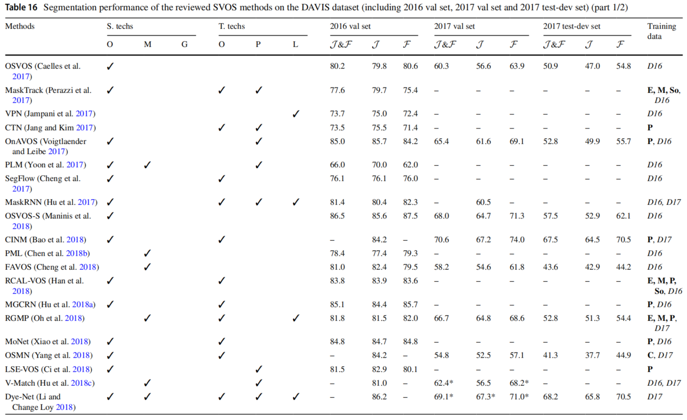

# Section 4. 方法

## Section 4.1. 基于在线精调的VOS方法

表3与表4中展示了大多数早期的SVOS方法是通过在线精调实现的。给定标注的对象和一个用于通用对象分割的网络，这种技术使用标注的对象精调网络。采用这种方式，网络可以“记住”标注对象的性质（如: 外观、形状和类别），并且将其输出域从一般对象转移到标注对象。技术图解参见图7所示，输入视频序列的分割过程如下: ⑴在标注帧上精调预训练网络；⑵在剩余帧上使用精调网络执行分割。一般来说，这种技术并不适用于UVOS，因为UVOS中没有标注的架构。然而，随着实例级方法的融合，某些UVOS方法在第一帧上执行实例分割，然后预测的对象被用于精调分割网络。

图7. 基于在线精调技术的VOS方法图解。通过三个主要步骤将分割网络的输出域从通用知识转移到标注对象: ⑴使用在ImageNet上预训练的参数初始化网络（灰色）；⑵在对象分割数据库（如: MS-COCO）和DAVIS上预训练网络（绿色）；⑶在标注帧上精调网络（黄色）。由于预训练和精调分别在推理之前和推理之中，因此也分别称之为“离线”过程和“在线”过程。

本节讨论了基于在线精调方法的几个代表和变种。在4.1.1节中，首先介绍了OSVOS（One-Shot VOS，单样本VOS），它是第一个用于在线SVOS精调的方法。接下来，在4.1.2节中回顾了从OSVOS衍生出来的方法。最后，在4.1.3节中介绍了几种用于高效VOS的在线精调方法的变体。在4.1.4节中总结了所讨论的方法，它们的发展路线参见图8。

图8. 基于在线精调的代表性方法的发展路线图。OSVOS是第一个使用在线精调的SOVS方法。此后，好几种方法都是从OSVOS衍生出来的。它们对OSVOS的主要改进以团体字和前缀“+”来标识。最近，提出了几种在线精调的变种用于高效VOS。请注意，蓝色与黑色单词分别表示UVOS和SVOS。

### 4.1.1 OSVOS（单样本视频对象分割）

OSVOS（One-Shot Video Object Segmentation）[^Caelles,2017]是最早基于在线精调的SVOS方法。分割网络的预训练和精调与图7相同。在推理阶段，OSVOS先用第一帧标注精调预训练网络。然后，每一帧的分割结果都被输入到精调网络实现初始预测，再由轮廓检测网络执行精调。

在DAVIS-2016和YouTube-Objects数据集上取得了有竞争力的结果证明了在SVOS上在线精调的价值。然而，仍有一些挑战是OSVOS处理不好了，例如: 对象属性变化和混淆区域。因为OSVOS只在第一帧标注的指导下进行精调，因此精调后的网络很容易出现过拟合，无法充分适应对象的变化。此外，精调网络很容易被那些看起来与标注对象相似的区域所误导。

### 4.1.2 OSVOS的扩展

帧数: 用于精调网络的帧数；数据增强: 增强有效数据的策略，标准意味着分割任务中通常的数据增强方式；自适应: 对象变换时使用的自适应网络的策略

在OSVOS的基础上，已经开发了一些扩展方法，以充分地利用在线精调，并且处理上述的挑战。表6简要地总结了OSVOS及其扩展在精调方面的特性。

表6. OSVOS及其扩展的汇总

| Year  | 会议  | 类型  | 论文标题、链接和缩写                                                                                                                                                                                                                                         |                            代码                             | 帧数   | 数据增强             | 自适应性                       |
| :---: | :---: | :---: | ------------------------------------------------------------------------------------------------------------------------------------------------------------------------------------------------------------------------------------------------------------ | :---------------------------------------------------------: | ------ | -------------------- | ------------------------------ |
| 2017  | CVPR  | SVOS  | [One-Shot Video Object Segmentation](https://openaccess.thecvf.com/content_cvpr_2017/papers/Caelles_One-Shot_Video_Object_CVPR_2017_paper.pdf) (OSVOS)                                                                                                       |    [PyTorch](https://github.com/kmaninis/OSVOS-PyTorch)     | 第一帧 | 标准                 | 未考虑                         |
| 2017  | BMVC  | SVOS  | [Online Adaptation of Convolutional Neural Networks for Video Object Segmentation](https://arxiv.org/pdf/1706.09364.pdf) (OnAVOS)                                                                                                                            | [Tenserflow](https://www.vision.rwth-aachen.de/page/OnAVOS) | 所有帧 | 标准                 | 在高置信结果上精调             |
| 2018  | TPAMI | SVOS  | [Video Object Segmentation without Temporal Information](https://ieeexplore.ieee.org/document/8362936) (OSVOS-S)                                                                                                                                             |    [Website](https://cvlsegmentation.github.io/osvos-s/)    | 第一帧 | 标准                 | 精调网络和Mask R-CNN的输出融合 |
| 2018  | ECCV  | SVOS  | [Video Object Segmentation by Learning Location-Sensitive Embeddings](https://www.ecva.net/papers/eccv_2018/papers_ECCV/papers/Hai_Ci_Video_Object_Segmentation_ECCV_2018_paper.pdf) (LSE-VOS)                                                               |                                                             | 所有帧 | 标准                 | 在预分割结果上精调             |
| 2019  | IJCV  | SVOS  | [Lucid Data Dreaming for Video Object Segmentation](https://link.springer.com/article/10.1007/s11263-019-01164-6)                                                                                                                                            |  [MATLAB](https://github.com/ankhoreva/LucidDataDreaming)   | 第一帧 | 生成2500对空间连续帧 | 未考虑                         |
| 2019  | CVPR  | SVOS  | [BubbleNets: Learning to Select the Guidance Frame in Video Object Segmentation by Deep Sorting Frames](https://openaccess.thecvf.com/content_CVPR_2019/papers/Griffin_BubbleNets_Learning_to_Select_the_Guidance_Frame_in_Video_Object_CVPR_2019_paper.pdf) |     [Tensorflow](https://github.com/griffbr/BubbleNets)     | 最优帧 | 标准                 | 未考虑                         |

OnAVOS（Online Adaptive VOS，在线自应用VOS）[^Voigtlaender&Leibe,2017]使用在线自应用策略改进OSVOS。与OSVOS不同的是，OnAVOS通过预测帧的高置信度结果和明确的背景对网络进一步精调。讨论: OnAVOS拥有更多的自适应性，可以处理来自背景的干扰。然而，由于推理过程中需要多次在线精调，因此非常耗时。

OSVOS-S（OSVOS-Semantic，语义OSVOS）[^Maninis,2018]使用语义信息改进OSVOS。分割是通过合并OSVOS和Mask R-CNN[^He,2017]分别预测的掩膜实现的，其中目标对象类别是从第一帧的标注中推理出来的，并且用于过滤掉不相关的对象。讨论: 由于Mask R-CNN在对象掩膜生成方面的优势，可以获得少量丢失的掩膜。然而，这样的改进是以多个深度网络导致的高GPU计算代价实现的。

LSE-VOS（Location-Sensitive Embeddings for VOS，位置感知嵌入VOS）[^Ci,2018]通过对所有的视频帧分割两次执行SVOS。第一轮的结果作为训练样本用于进一步的精调。此外，LSE模块将目标对象与混淆的背景区分开来。讨论: 与OnAVOS类似，更多的训练样本给网络带来更好的自适应性，而LSE模块提高了对复杂背景的鲁棒性。然而，LSE-VOS因为需要两次VOS，所以是低效的。

LucidTracker（Lucid Data Dreaming，清晰的数据梦）[^Khoreva,2019]改善了数据增强，其中2500个视频片段是由第一帧的标注生成，每个片段包含两个时间上连续的“图像——掩膜对”以支持时间学习。讨论: 与其他基于在线精调的方法不同，LucidTracker可以生成具有更加多样性的训练数据，使得精调的网络更加接近目标领域，即使网络是随机初始化的。然而，只从一帧中生成数据对于LuciTracker也存在困难，因为由此产生的网络自适应性也是有限的。

BubbleNets[^Griffin&Corso,2019]从一个新的角度改进了基于在线精调的VOS。截止2018年，我们发现几乎所有这类方法（如: OSVOS，OnAVOS，OSVOS-S，LSE-VOS）都使用第一帧标注来精调网络。对于拥有所有帧的离线应用（如: 视频编辑），标注第一帧无法带来最好的精调结果。作者发现了这个问题，并且提出了BubbleNets，可以预测最优标注帧。讨论: 使用BubbleNets后，OSVOS和OnAVOS的平均性能在DAVIS-2016和DAVIS-2017验证集上分别提高了$3.5\%$和$5.95\%$。这样的改进表明，BubbleNets可以成为基于在线精调方法的一个增量模块。

### 4.1.3 OSVOS的变体

上述扩展改善了VOS的结果。然而，受到在线精调的时间和计算成本影响，分割的效率不高。为了解决这个问题，同时转移网络输出域，目前的方法实现了更加有效的算法来优化分割网络的部件，而不是通过反向传播来精调整个网络。与在线精调类似，这些方法也根据标注的帧来调节网络参数。因此，我们将它们看作基于在线精调方法的变体。表7简要地总结了这些变体。

表7. 在线精调的代表性变体汇总

| Year  | 会议  | 类型  | 论文标题、链接和缩写                                                                                                                                                                                                                                                                    |                          代码                           | 技术                       | 参数                                           |
| :---: | :---: | :---: | --------------------------------------------------------------------------------------------------------------------------------------------------------------------------------------------------------------------------------------------------------------------------------------- | :-----------------------------------------------------: | -------------------------- | ---------------------------------------------- |
| 2018  | CVPR  |   S   | [Efficient Video Object Segmentation via Network Modulation](https://openaccess.thecvf.com/content_cvpr_2018/papers/Yang_Efficient_Video_Object_CVPR_2018_paper.pdf) (OSMN)                                                                                                             | [Tensorflow](https://github.com/linjieyangsc/video_seg) | 条件批归一化               | 等式2中的$\gamma$与$\beta$                     |
| 2019  | CVPR  |   S   | [A Generative Appearance Model for End-to-end Video Object Segmentation](https://openaccess.thecvf.com/content_CVPR_2019/papers/Johnander_A_Generative_Appearance_Model_for_End-To-End_Video_Object_Segmentation_CVPR_2019_paper.pdf) (AGAME)                                           | [PyTorch](https://github.com/joakimjohnander/agame-vos) | 高斯混合模型               | 等式3中的$\mathbf{\mu}_k$和$\mathbf{\Sigma}_k$ |
| 2020  | CVPR  |   S   | [Learning Fast and Robust Target Models for Video Object Segmentation](https://openaccess.thecvf.com/content_CVPR_2020/papers/Robinson_Learning_Fast_and_Robust_Target_Models_for_Video_Object_Segmentation_CVPR_2020_paper.pdf) (FRTM)                                                 |     [PyTorch](https://github.com/andr345/frtm-vos)      | 目标模型（预测粗略掩膜）   | 目标模型参数                                   |
| 2020  | ECCV  |   S   | [Learning What to Learn for Video Object Segmentation](https://www.ecva.net/papers/eccv_2020/papers_ECCV/papers/123470766.pdf) (LWL)                                                                                                                                                    |    [PyTorch](https://github.com/visionml/pytracking)    | 目标模型（预测多通道掩膜） | 目标模型参数                                   |
| 2021  | CVPR  |   U   | [Target-Aware Object Discovery and Association for Unsupervised Video Multi-Object Segmentation](https://openaccess.thecvf.com/content/CVPR2021/papers/Zhou_Target-Aware_Object_Discovery_and_Association_for_Unsupervised_Video_Multi-Object_Segmentation_CVPR_2021_paper.pdf) (TAODA) |                                                         | 目标模型（预测粗略掩膜）   | 目标模型参数                                   |

OSMN（Object Segmentation via Network Modulation）[^Yang,2018]用一个基于条件批归一化（Conditional Batch Normalization, CBN）[^DeVries,2017]的模块来精调网络: 
$$
\mathbf{y}=\gamma\mathbf{x}+\boldsymbol{\beta}
$$
在第一帧的标注$\gamma$和前一帧的掩膜$\boldsymbol{\beta}$的引导下，中间特征$\mathbf{x}$被转换到$\mathbf{y}$。讨论: 网络输出域可以通过一次前向传递进行转换，这比在线精调的效率高出许多。但是用于的精调的信息较少，使得分割的质量并未像效率提升那么明显。

A-GAME（A Generative Appearance Model for End-to-End VOS）[^Johnander,2019]使用高斯混合模型保证网络自适应对象: 
$$
p(z_p=k|\mathbf{x}_p,\boldsymbol{\mu}_k,\boldsymbol{\Sigma}_k)=
\frac
{p(z_p=k)\cdot\mathcal{N}(\mathbf{x}_p|\boldsymbol{\mu}_k,\boldsymbol{\Sigma}_k)}
{\Sigma_k p(z_p=k)\cdot\mathcal{N}(\mathbf{x}_p|\boldsymbol{\mu}_k,\boldsymbol{\Sigma}_k)}
$$
其中，概率为像素$p$属于第$k$个组件（目标对象或者背景）的可能性，取决于其外观$\mathbf{x}_p$、$p(z_p=k)=1/K$（$K$表示组件数目）、$\boldsymbol{\mu}_k$和$\boldsymbol{\Sigma}_k$。后面两个参数的值是通过第一帧的标注完成初始化的，然后由后面帧的输出完成更新的。讨论: 与OSNM不同的是，A-GAME对分割网络施加了更加明确和持久的影响，导致了更高质量的结果。

FRTM（Fast and Robust Target Models for VOS）[^Robinson,2020]设计了一个非判别性的线性模型，用于生成特定目标的预测，然后通过一个分割网络来完善这些预测。在推理过程中，只有目标模型需要训练，在第一帧的标注和后续帧的预测通过执行高斯-牛顿优化算法[^Tjaden,2018]获得结果。讨论: 由于轻量级的目标模型和高效的优化过程，FRTM相比基于在线精调的方法可以更快地执行SVOS。此外，与OSMN和A-GAME不同的是，FRTM拥有更多的特定目标参数，从而提升了对目标对象和背景的分辨能力。

LWL（Learn What to Learn）[^Bhat,2020]设计了一个类似于FRTM的管道。然而，LWL的目标模型为每个对象预测了一个多通过掩膜，并且通过一个可微的方法执行优化。具体来说，LWL从两个可以学习的模块中而不是标注中生成了基准掩膜和权重矩阵（用于平衡目标对象与背景区域）。讨论: LWL离线训练两个模块，使得它们能够基于最终分割结果的损失，为目标模型学习如何生成最优目标（如: 学着如何去学习）。因此，LWL相比FRTM获得了更加稳健的结果，同时保持了有竞争力的效率。

TAODA（Target-Aware Object Discovery and Association for UVOS）[^Zhou,2021]实现了与FRTM类似的目标模型，以生成粗略的对象掩膜。不同的是，由于UVOS中没有标注，目标模型的初始化使用的是第一帧的预测实例。与其他 UVOS方法不同的是，目标模型为每个要分割的对象提供了一个很好的先验，减少了在整个序列中关联对象的代价。

### 4.1.4 在线精调方法总结

本节介绍了基于在线精调VOS方法及其变种。这些方法源于OSVOS[^Caelles,2017]，OSVOS是通过对第一帧的标注精调网络参数，从而将网络输出域从一般知识转向目标对象。这些扩展工作和网络变体主要是由OSVOS中的下列问题引起的: ⑴仅考虑第一帧 的标注，限制了精调网络的自适应性，导致了过拟合；⑵在线精调的时间消耗过大，限制了VOS的效率。

这些扩展工作改善了OSVOS的自适应性和稳健性。例如: OnAVOS和LSE-VOS通过纳入过去帧的高置信度结果来提升自适应性。然而，在推理过程中需要进行多次在线精调，从而降低了VOS的效率。OSVOS-S和LucidTracker则在没有额外在线精调的基础上，增强了分割的稳健性。OSVOS-S是结合一般知识来完善VOS的结果，而LucidTracker则是通过从标注中生成更加多样性的样本来提升质量。这些方法都促进了VOS的性能，但是由于Mask R-CNN或者数据增强都需要额外的计算代价，所以网络模型的效率仍然不主。与上述方法不同，BubbleNets则是一种增量方法，它可以被融合到上述方法中，用于预测要标注的最佳框架。事实上，这样的最优帧也是以效率为代价产生的，因此基于在线精调的VOS适用于关注分割精度而非效率的离线应用。

这些VOS的变体则更加关注效率。在没有在线精调的情况下，所讨论的变体（OSNM、A-GAME、FRTM、LWL和TAODA）已经开发了更加高效的算法来转移网络输出域。虽然也取得了更好的效率，但是早期的变体（OSNM和A-GAME）与扩展工作中的方法相比仍然存在精度上的差距。从表16与表17中可以看出，基于目标模型的变体（FRTM和LWL）进一步提高了SVOS的性能。同时，这种改进也带到了UVOS的研究中（TAODA）。基于表7可知，性能提升的原因可能在于推理过程中目标模型可调参数的数量增多（FRTM、LWL和TAODA的可调参数的数量比OSNM和A-GAME要多）。换句话说，这个数字可能反映了在VOS方法中判别性和特定目标特征的编码能力。

表16. 在DAVIS数据集（包括：2016验证集、2017验证集、2017测试-开发集）回顾的SVOS方法的分割性能

S.techs: 空间技术；O: 在线精调；M: 匹配技术；G: 图模型；T.techs: 时间技术；O: 光流；P: 掩膜传播；L: 长时时间传播；‘-’: 没有给出；$\mathcal{J,F}$: Jaccard指数和F-测度的均值（参见等式1）；$\mathcal{J}\&\mathcal{F}$: $\mathcal{J}$和$\mathcal{F}$的均值；C: COCO；D: DUTS；E: ECSSD；Hr: HRSOD；H: HKU-IS；P: PASCAL VOC；M: MSRA10K；Ma: Mapillary；S: SBD；So: SOC；I: ILSO；B: BIG；F: FS-1000；D16：DAVIS-2016；D17：DAVIS-2017；IV: ImageNet-Video；YV: YouTube-VOS；**粗体字数据集**：基于图像的；*斜体字数据集*：基于视频的；带星号的得分表示使用原始代码但是并非原始工作成果。

表17. 在DAVIS数据集（包括：2016验证集、2017验证集、2017测试-开发集）回顾的SVOS方法的分割性能

S.techs: 空间技术；O: 在线精调；M: 匹配技术；G: 图模型；T.techs: 时间技术；O: 光流；P: 掩膜传播；L: 长时时间传播；‘-’: 没有给出；$\mathcal{J,F}$: Jaccard指数和F-测度的均值（参见等式1）；$\mathcal{J}\&\mathcal{F}$: $\mathcal{J}$和$\mathcal{F}$的均值；C: COCO；D: DUTS；E: ECSSD；Hr: HRSOD；H: HKU-IS；P: PASCAL VOC；M: MSRA10K；Ma: Mapillary；S: SBD；So: SOC；I: ILSO；B: BIG；F: FS-1000；D16：DAVIS-2016；D17：DAVIS-2017；IV: ImageNet-Video；YV: YouTube-VOS；**粗体字数据集**：基于图像的；*斜体字数据集*：基于视频的；带星号的得分表示使用原始代码但是并非原始工作成果。
