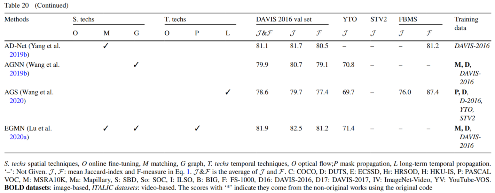

# Section 4. 方法

## Section 4.2. 基于特征匹配的VOS方法

这种方法通过测量目标帧和参考帧之间的对应关系来执行VOS，参见图9。”目标帧“表示要分割的视频帧，”参考帧“在不同的VOS中具有不同的含义。在SVOS中，”参考帧“由标注的帧和部分/全部的过去帧组成。分割的目标是根据测量到的对应关系，将参考帧掩膜传播到目标帧。在UVOS中，”参考帧“可能包括任意过去/未来帧。根据测量的对应关系，UVOS方法定位出现在目标帧和参考帧中的对象。

图9. 基于匹配的VOS方法图解，可以同时应用于SVOS和UVOS应用。由于UVOS中没有标注，所以顶部的分支主要是为SVOS方法提供额外的输入（即对象掩膜）

可靠的和稳健的对应关系的关键是判别性特征嵌入。大多现有方法是通过在大规模图像/视频数据集上训练骨架网络或者利用两万的对象检测/分割方法来实现的。因为这些工作都可以离线完成，相比在线精调方法，基于匹配的方法执行速度更快、模型性能更好。因此，大多最新的VOS方法（特别是SVOS）都是基于特征匹配的，详见表3、表4和表5。

本节介绍了有代表性的基于匹配的方法，其发展路线图参见图10所示。基于不同的特征类型，所讨论的方法分为两类：像素级匹配和ROI（感兴趣区域）级匹配。前者（第4.2.1节）测量帧之间像素级特征对应关系。后者（第4.2.2节）仅关注ROI级的对应关系。第4.2.3节总结了讨论的方法。

图10. 有代表性的基于匹配的方法的开发路线图。注意到蓝色、黑色和红色的文字分别表示执行UVOS、执行SVOS及两者都做。STM[^Oh,2019]由于其突破性的创新和众多的扩展，使用粗体标注。

### 4.2.1 像素级特征匹配

这种方法通过测量帧之间像素级对应关系来执行VOS。如图11所示，有两种方式实现像素级匹配模式：隐式匹配和显式匹配。前者设计了一个网络模块来隐含地预测跨帧的相似性；而后者则显式地匹配帧间每对像素之间的特征。在给定的不同实现中，我们先介绍基于隐式匹配的方法，然后再介绍基于显式匹配的方法，最后再讨论基于像素级匹配的两个变体。表8汇总了所有讨论的方法。

表8. 讨论的基于像素级匹配方法的汇总

| Year  |  会议   | 类型  | 论文标题、链接和缩写                                                                                                                                                                                                                                                  |                                        代码                                        | 参考帧数                            | 匹配模式   | 测度模型                            |
| :---: | :-----: | :---: | --------------------------------------------------------------------------------------------------------------------------------------------------------------------------------------------------------------------------------------------------------------------- | :--------------------------------------------------------------------------------: | ----------------------------------- | ---------- | ----------------------------------- |
| 2017  |  ICCV   | SVOS  | [Pixel-Level Matching for Video Object Segmentation using Convolutional Neural Networks](https://openaccess.thecvf.com/content_ICCV_2017/papers/Yoon_Pixel-Level_Matching_for_ICCV_2017_paper.pdf) (PLM)                                                              |               [Website](https://jsyoon4325.wixsite.com/pix-matching)               | 1                                   | 局部       | 全连接层                            |
| 2018  |  CVPR   | SVOS  | [Fast Video Object Segmentation by Reference-Guided Mask Propagation](https://openaccess.thecvf.com/content_cvpr_2018/papers/Oh_Fast_Video_Object_CVPR_2018_paper.pdf) (RGMP)                                                                                         |                   [PyTorch](https://github.com/seoungwugoh/RGMP)                   | 1                                   | 局部       | 卷积层                              |
| 2018  |  CVPR   | SVOS  | [Blazingly Fast Video Object Segmentation with Pixel-Wise Metric Learning](https://openaccess.thecvf.com/content_cvpr_2018/papers/Chen_Blazingly_Fast_Video_CVPR_2018_paper.pdf) (PML)                                                                                |                    [Caffe](https://github.com/yuhuayc/fast-vos)                    | PR（第一帧，高置信度结果）          | 全局       | L2相似性                            |
| 2018  |  ECCV   | SVOS  | [VideoMatch: Matching based Video Object Segmentation](https://www.ecva.net/papers/eccv_2018/papers_ECCV/papers/Yuan-Ting_Hu_VideoMatch_Matching_based_ECCV_2018_paper.pdf) (VideoMatch)                                                                              |        [Website](https://sites.google.com/view/videomatch/home?authuser=0)         | 1                                   | 全局       | Cosine相似性                        |
| 2019  |  ICCV   | SVOS  | [AGSS-VOS: Attention Guided Single-Shot Video Object Segmentation](https://openaccess.thecvf.com/content_ICCV_2019/papers/Lin_AGSS-VOS_Attention_Guided_Single-Shot_Video_Object_Segmentation_ICCV_2019_paper.pdf) (AGSS-VOS)                                         |               [PyTorch](https://github.com/dvlab-research/AGSS-VOS)                | 1                                   | 局部       | 卷积层                              |
| 2019  |  CVPR   | SVOS  | [FEELVOS: Fast End-to-End Embedding Learning for Video Object Segmentation](https://openaccess.thecvf.com/content_CVPR_2019/papers/Voigtlaender_FEELVOS_Fast_End-To-End_Embedding_Learning_for_Video_Object_Segmentation_CVPR_2019_paper.pdf) (FEELVOS)               | [Tensorflow](https://github.com/tensorflow/%20models/tree/master/research/feelvos) | 1, t-1                              | 局部，全局 | $1-\frac2{1+\exp(\|e_p-e_q\|^2)}$   |
| 2019  |  ICCV   | SVOS  | [RANet: Ranking Attention Network for Fast Video Object Segmentation](https://openaccess.thecvf.com/content_ICCV_2019/papers/Wang_RANet_Ranking_Attention_Network_for_Fast_Video_Object_Segmentation_ICCV_2019_paper.pdf) (RANet)                                     |                    [PyTorch](https://github.com/Storife/RANet)                     | 1, t-1, (1, t-1, 5)                 | 全局       | 点积                                |
| 2019  |  CVPR   | UVOS  | [See More, Know More: Unsupervised Video Object Segmentation with Co-Attention Siamese Networks](https://openaccess.thecvf.com/content_CVPR_2019/papers/Lu_See_More_Know_More_Unsupervised_Video_Object_Segmentation_With_Co-Attention_CVPR_2019_paper.pdf) (COS-Net) |                  [PyTorch](https://github.com/carrierlxk/COSNet)                   | 从输入序列中均匀采样5帧             | 全局       | 权重点积                            |
| 2019  |  ICCV   | UVOS  | [Anchor Diffusion for Unsupervised Video Object Segmentation](https://openaccess.thecvf.com/content_ICCV_2019/papers/Yang_Anchor_Diffusion_for_Unsupervised_Video_Object_Segmentation_ICCV_2019_paper.pdf) (AD-Net)                                                   |                 [PyTorch](https://github.com/yz93/anchor-diff-VOS)                 | 1, t                                | 全局       | 点积                                |
| 2020  |  CVPR   | SVOS  | [A Transductive Approach for Video Object Segmentation](https://openaccess.thecvf.com/content_CVPR_2020/papers/Zhang_A_Transductive_Approach_for_Video_Object_Segmentation_CVPR_2020_paper.pdf) (TVOS)                                                                |          [PyTorch](https://github.com/microsoft/transductive-vos.pytorch)          | [t-4, t-1], 从[1, t-5]中稀疏采样5帧 | 局部，全局 | 权重点积                            |
| 2020  |  ECCV   | SVOS  | [Collaborative Video Object Segmentation by Foreground-Background Integration](https://www.ecva.net/papers/eccv_2020/papers_ECCV/papers/123500324.pdf) (CFBI)                                                                                                         |                    [PyTorch](https://github.com/z-x-yang/CFBI)                     |                                     |            |                                     |
| 2021  |  TPAMI  | SVOS  | [Collaborative Video Object Segmentation by Multi-Scale Foreground-Background Integration](https://ieeexplore.ieee.org/abstract/document/9435058) (CFBI+)                                                                                                             |                    [PyTorch](https://github.com/z-x-yang/CFBI)                     | 1, t-1                              | 局部，全局 | $1-\frac2{1+\exp(\|e_p-e_q\|^2+b)}$ |
| 2021  | NeurIPS | SVOS  | [Associating Objects with Transformers for Video Object Segmentation](https://proceedings.neurips.cc//paper/2021/file/147702db07145348245dc5a2f2fe5683-Paper.pdf) (AOT)                                                                                               |                [PyTorch](https://github.com/yoxu515/aot-benchmark)                 | 1, t-1, (1, t-1, 5)                 | 局部，全局 | 点积                                |

参考帧中的第一项表示参考帧的索引数。请注意，”PR“（Point-based Reference，基于点的参考）意味着参考是由特征点而不是特征图组成的。”(1, t-1)“表示在第一帧与前一帧之间采样（不包括第一帧与前一帧），采样间隔为5。$e_p$和$e_q$从不同帧中得到的像素级特征。$b$表示可以训练的偏差。

#### 隐式匹配

PLM（Pixel-Level Matching，像素级匹配）[^Yoon,2017]是最早出现的基于匹配的SVOS方法之一。该方法在前一帧和目标帧之间执行多尺度匹配来分割目标对象。为了抑制不明确的背景，只考虑前一帧对象周围的区域。讨论：虽然取得了良好的效率，但是由于PLM只在帧之间进行局部匹配，所以分割结果容易受到快速运动和遮挡的影响。

RGMP（Reference-Guided Mask Propagation）[^Oh,2018]在第一帧和目标帧之间进行匹配。与PLM不同，RGMP将物体掩膜与视频帧一起编码，隐含地合并了物体外观和位置先验。讨论：由于加强了数据增强和有效的特征融合，RGMP在效率和准确性方面都表现良好。然而，由于需要重复运行，RGMP在多对象分割中的效率不高。

AGSS-VOS（Attention Guided Single-Shot VOS）[^Lin,2019]改进了RGMP中的匹配模块，在单一的前馈路径中处理所有对象。然后，多个目标对象被一个轻量级的特定目标模块分享。讨论：虽然后一个模块需要重复运行，但是其相对轻量级的结构仍然减轻了计算成本。然而，由于集成了用于对象分享和光流的额外模块，整体架构变得更加复杂。

#### 显式匹配

PML（Pixel-wise Metric Learning）[^Chen,2018b]是最早使用像素相似度的深度方法之一。目标帧中的每个像素都是根据其与所有参考像素的前$k$个相似性来标记的，这些相似性是以第一帧标注完成初始化的，并且通过高置信度的结果实现更新的。讨论：由于在基于匹配的标记之后不需要解码，PML在SVOS中实现了很高的效率。然而，PML不能处理混淆的背景，因为它在很大程度上依赖于匹配的结果。

VideoMatch[^Hu,2018c]为SVOS实现了一种软匹配策略。与PML不同的是，VideoMatch利用平均的前$k$个相似度来生成最终结果。此外，还提出了一个离群点去除模块，以过滤远离先前结果的混淆背景。讨论：与PML相比，VideoMatch对杂乱的场景具有稳健性。然而，这种稳健性是有限的，因为其仍然严重依赖于匹配结果。

FEELVOS（Fast End-to-End Learning for VOS）[^Voigtlaender,2019]将匹配结果视为隐式引导，而不是直接基于标注进行传播（如：PML和VideoMatch）。具体来说，FEELVOS在第一帧/前一帧和目标帧之间进行全局/局部匹配，然后匹配结果与语义特征相融合用于预测最终的结果。讨论：与上述方法不同的是，FEELVOS进一步减弱了背景的干扰。然而，其自适应性是有限的，因为只有第一帧和前一帧用于参考。

RANet（Ranking Attention Network）[^Wang,2019d]在匹配过程中只考虑高置信度而不是所有特征。为此，RANet还实现了一个排名注意力的模块，以选择有助于分割的可靠的特征。讨论：与其他方法相比，RANet过滤了潜在的噪声，在复杂的场景中获得了更好的稳健性。然而，如FEELVOS一样，由于参考帧的数目限制，其自适应性较差。

##### :star2::star2: Memory-based VOS Methods

STM（Space-Time Memory network）[^Oh,2019]在SVOS中取得了巨大的突破。除了第一帧和前一帧，STM还考虑了它们之间的中间帧作为参考信息，以便更好地适应对象的变化。与上述方法不同的是，STM以类似注意力的模式执行VOS：⑴从目标帧和参考帧中编码键/值特征；⑵测量帧之间的键相似性；⑶将相似性视为权重去汇总参考值；⑷将目标值与相加的值拼接起来送入解码器以预测最终输出。由于其高效而全面的匹配模式，STM在所有基准数据集上都取得了当时最先进的性能，同时保持了相当低的计算代价。

STM的成功激励了许多新的方法，这些方法从以下几个方面改善了SVOS的性能：⑴匹配模式：STM只考虑帧之间的全局匹配，这很容易受到相似的目标对象/背景的影响；⑵编码器架构：由于输入通道不同（目标帧：RGB；参考帧：RGB+掩膜），STM对目标帧和参考帧采用了不同的编码器，增加了架构的冗余度；⑶记忆管理：随着分割的推进，STM的中间帧数目快速增长，导致在分割长时视频时出现内存不足；⑷参考帧之间的时间对应：STM分别考虑所有参考帧，忽略了这些帧之间的对应关系；⑸相似性测度：STM使用点积作为相似性测度，但是最近的工作表明点积可能会减少对参考特征的利用率；⑹多尺度匹配：STM只在最粗略的特征图之间进行匹配，忽略了细粒度的对应关系，限制了性能的进一步提升。

STM扩展工作的简要介绍如下：

EGMN（Episodic Graph Memory Network）[^Lu,2020a]在时间关系上改善了STM。为此，该方法在参考帧上构建了一个全连接图，并且在它们之间进行信息传播。讨论：由于强化了参考，EGMN在一些基准上的表现优于STM。然而，这种改进是以效率为代价的，因为基于图的传播非常耗时。

KMN（Kernelized Memory Network）[^Seong,2020]在匹配模式上改善了STM。该方法假设每个参考点在目标帧中都有一个候选区域，通过二维高斯核来表示这个区域，这个高斯核以目标帧中非常相似的点为中心。讨论：高斯核限制了一些混淆对象/背景对分割结果的影响，使得KMN的表现优于STM。然而，如果具有强烈混淆性的区域（如：与目标对象具有相同类别的对象）与参考点相互匹配，那么它们仍然无法分割。

AFB-URR（Adaptive Feature Bank-Uncertain Region Refinement）[^Liang,2020]在记忆管理上改善了STM。为此，该方法创建了一个固定大小的记忆库方便有效地利用空间。最后的输出是由一个基于不确定性的模块来完善的。讨论：AFB-URR可以支持长时视频的SVOS。在相同的训练配置下，AFB-URR以较少的内存空间和计算量实现了与STM相似的性能。

SwiftNet[^Wang,2021]在记忆管理和编码器架构上改善了STM。该方法使用与AFB-URR相似的策略构建记忆库，但是使用了不同的更新触发器。而且，因为所有参考帧（除第一帧外）在成为目标帧前就被编码了，所以该方法实现了一个轻量级的模块在已经编码的目标特征之上对参考特征进行编码，而不用从头开始。讨论：与上述基于STM的方法不同，SwiftNet用较少的参数预测出有竞争力的结果，因此在SVOS的准确性和效率之间达到了当时最好的平衡。

LCM[^Hu,2021]在匹配模式上改善了STM。上述基于STM的方法都是在全部参考帧和目标帧之间执行全局匹配，而LCM则在先前帧和目标帧之间执行局部匹配。局部匹配是通过将位置编码[^Parmar,2018]附加到参考键和目标键上实现的。讨论：LCM隐含地鼓励了空间相邻点之间的标注传播，这样符合视频中对象运动的性质，有助于抑制空间距离较远的混淆背景。

RMNet（Regional Memory Network）[^Xie,2021]在匹配模式上改善了STM。与LCM不同，RMN用更加直接的方式执行局部匹配，只涉及ROI内的参考和目标帧特征。在参考和目标帧内的ROI是基于预测的对象掩膜和光流生成的。讨论：RMN对空间距离较远的混淆背景具有稳健性。然而，这种改进是以额外的特征（光流）计算为代价实现的。

HMMN（Hierarchical Memory Matching Network）[^Seong,2021]在多尺度匹配上改善了STM。除了在最粗略的尺度（步长16）上进行特征匹配，该方法还考虑了细粒度（步长为4和8）上的像素级对应关系。然而，HMMN完善了一个带有时间约束的核化方法（如：KMN），为每个参考点生成了候选位置。讨论：多尺度匹配给基于STM的SVOS带来了显著的性能改进。在最初的核化方法的基础上，时间平滑进一步减轻了混淆对象/背景的影响。

STCN（Space-Time Correspondence Network）[^Cheng,2021]在编码器架构和相似性指标方面改进了STM。在STCN中提出了上述所有基于STM的方法都存在的两个问题：⑴参考和目标键（要匹配的特征）由不同的编码器计算，这分散了帧之间的像素对应关系；⑵余弦距离限制了参考特征的利用效率。为了解决这些问题，STCN使用一个共享的架构对键进行编码，然后用一个轻量级的模块对值进行编码。至于相似性指标，STCN实现了一个高效的L2距离来代替余弦距离。此外，STCN还将前一帧从参考中删除以避免漂移错误。讨论：通过以上的努力，STCN在效率和准确性方面明显强于STM。由于STCN的结构简单有效，并且大小写存在一些挑战（如：容易受到混淆背景影响；特征仅在粗略尺度上匹配），因此STCN可以作为SVOS的一个新的基准方法。

最近，大多数方法都通过基于记忆的架构获得了有竞争力的结果。然而，仍有一些方法在探索VOS的不同方式，增加这个领域的多样性。具体如下：

TVOS（Transductive VOS）[^Zhang,2020]在SVOS中加入了直推式学习[^Zhou,2004]。与STM不同的是，TVOS将固定数量的帧作为参考，相似性受到像素间空间和时间距离的限制。讨论：因此，TVOS抑制了更多的干扰区域。因为TVOS仅在视频数据集上训练，其整体性能与STM及其变体相比较差，但是比具有相同训练设置的方法要好。

CFBI（Collaborative VOS by Foreground-Background Integration）[^Yang,2020]仅使用第一帧和前一帧作为参考。与其他基于匹配的方法不同，CFBI不分别对待前景与背景区域，隐含地增强了编码特征的可辨别性。通过将特征金字塔网络[^Lin,2017]融合到分割网络中，CFBI被扩展到处理多尺度目标对象（CFBI+[^Yang,2021b]）。讨论：与STM及其变体相比，由于强大的特征嵌入，CFBI和CFBI+在较少的参考框架下实现了类似的性能。

AOT（Associating Objects with Transformers）[^Yang,2021a]引入了多层Transformer模块来建立帧之间的对应关系。与本节中大多数方法不同，那些方法单独处理每个目标对象，而AOT实现了一个统一的机制来编码、匹配和解码多个对象。讨论：这种机制鼓励AOT更好地挖掘和利用对象之间的关系，于是在几个基准数据集上都获得了出色的性能。AOT的成功提供了一个完美的例子，说明Transformer是如何提升基于匹配的SVOS方法。

除了SVOS方法外，特征匹配也为UVOS方法带来了更好的结果。根据帧之间的像素级相关性，基于匹配的UVOS方法可以有效地定位序列中频繁出现的对象（甚至是静态对象）。

COSNet（Co-Attention Siamese Networks）[^Lu,2019]是UVOS方法，它通过协同注意力模块来解决显著性对象问题：
$$
\mathbf{S=X}_r^T\mathbf{WX}_t\tag{4}
$$
其中，$\mathbf{W}$是可以学习的权重矩阵，$\mathbf{X}_r$与$\mathbf{X}_t$分别表示参考帧和目标帧的特征。讨论：等式(4)关注的是帧之间的成对关系。虽然聚合多个$\mathbf{S}$可以在整个序列中实现更多的全局关系，但是由于该模块是使用成对帧执行的训练，因此结果信息仍然是有限的。为了解决这个问题，[^Lu,2020b]利用分组帧训练模块来扩展COSNet。具体来说就是$\mathbf{X}_r$从一个帧替换为多个参考帧的拼接。因此，模块被鼓励对多个帧之间的对应关系进行编码。

AD-Net（Anchor-Diffusion Network）[^Yang,2019b]在执行UVOS时既使用互相关性，还使用自相关性来定位显著对象：

$\mathbf{S_{cross}=X_1 X}_t^T,\mathbf{S_{auto}=X_t X}_t^T$

其中，$\mathbf{X_1},\mathbf{X}_t$分别表示参考帧和目标帧的特征。讨论：与COSNet不同的是，AD-Net仅考虑参考帧的第一帧，加速了相关性的计算。同时，自相关性带来了更多的具有判别性的嵌入特征。然而，AD-Net仅在前景对象出现在第一帧的条件下正常工作，不能适用于第一帧为空的序列中。

表8. 讨论的基于像素级匹配方法的汇总

| Year  |  会议   | 类型  | 论文标题、链接和缩写                                                                                                                                                                                                                                          |                         代码                         | 参考帧数                    | 匹配模式   | 测度模型 |
| :---: | :-----: | :---: | ------------------------------------------------------------------------------------------------------------------------------------------------------------------------------------------------------------------------------------------------------------- | :--------------------------------------------------: | --------------------------- | ---------- | -------- |
| 2019  |  ICCV   |   S   | [Video Object Segmentation using Space-Time Memory Networks](https://openaccess.thecvf.com/content_ICCV_2019/papers/Oh_Video_Object_Segmentation_Using_Space-Time_Memory_Networks_ICCV_2019_paper.pdf) (STM)                                                  |    [PyTorch](https://github.com/seoungwugoh/STM)     | 1, t-1, (1, t-1, 5)         | 全局       | 点积     |
| 2020  |  ECCV   |  S&U  | [Video Object Segmentation with Episodic Graph Memory Networks](https://www.ecva.net/papers/eccv_2020/papers_ECCV/papers/123480664.pdf) (EGMN)                                                                                                                | [PyTorch](https://github.com/carrierlxk/GraphMemVOS) | 1, t-1, 4中间帧（均匀采样） | 全局       | 点积     |
| 2020  |  ECCV   |   S   | [Kernelized Memory Network for Video Object Segmentation](https://www.ecva.net/papers/eccv_2020/papers_ECCV/papers/123670630.pdf) (KMN)                                                                                                                       |                                                      | 1, t-1, (1, t-1, 5)         | 局部，全局 | 点积     |
| 2020  | NeurIPS |   S   | [Video Object Segmentation with Adaptive Feature Bank and Uncertain-Region Refinement](https://proceedings.neurips.cc/paper/2020/file/234833147b97bb6aed53a8f4f1c7a7d8-Paper.pdf) (AFB-URR)                                                                   |   [PyTorch](https://github.com/xmlyqing00/AFB-URR)   | PR（第一帧，多样性特征）    | 全局       | 点积     |
| 2021  |  CVPR   |   S   | [SwiftNet: Real-time Video Object Segmentation](https://openaccess.thecvf.com/content/CVPR2021/papers/Wang_SwiftNet_Real-Time_Video_Object_Segmentation_CVPR_2021_paper.pdf) (SwiftNet)                                                                       | [PyTorch](https://github.com/haochenheheda/SwiftNet) | PR（第一帧，多样性特征）    | 全局       | 点积     |
| 2021  |  CVPR   |   S   | [Learning Position and Target Consistency for Memory-based Video Object Segmentation](https://openaccess.thecvf.com/content/CVPR2021/papers/Hu_Learning_Position_and_Target_Consistency_for_Memory-Based_Video_Object_Segmentation_CVPR_2021_paper.pdf) (LCM) |                                                      | 1, t-1, (1, t-1, 5)         | 局部，全局 | 点积     |
| 2021  |  CVPR   |   S   | [Efficient Regional Memory Network for Video Object Segmentation](https://openaccess.thecvf.com/content/CVPR2021/papers/Xie_Efficient_Regional_Memory_Network_for_Video_Object_Segmentation_CVPR_2021_paper.pdf) (RMNet)                                      |      [PyTorch](https://github.com/hzxie/RMNet)       | 1, t-1, (1, t-1, 5)         | 局部，全局 | 点积     |
| 2021  |  ICCV   |   S   | [Hierarchical Memory Matching Network for Video Object Segmentation](https://openaccess.thecvf.com/content/ICCV2021/papers/Seong_Hierarchical_Memory_Matching_Network_for_Video_Object_Segmentation_ICCV_2021_paper.pdf) (HMMN)                               |      [PyTorch](https://github.com/Hongje/HMMN)       | 1, t-1, (1, t-1, 5)         | 局部，全局 | 点积     |
| 2021  | NeurIPS |   S   | [Rethinking Space-Time Networks with Improved Memory Coverage for Efficient Video Object Segmentation](https://proceedings.neurips.cc/paper/2021/file/61b4a64be663682e8cb037d9719ad8cd-Paper.pdf) (STCN)                                                      |    [PyTorch](https://github.com/hkchengrex/STCN)     | 1, (1, t-1, 5)              | 全局       | L2相似性 |

#### 变体

迄今为止，在本节中讨论的方法都是基于像素级的匹配，其基本元素都是特征点。一般来说，每个点表示视频帧中具有规则形状的一个子区域。而这里讨论了一些基于不规则元素（例如：超级像素）的变体，表9总结了这些变体。

### Super-pixel-level & Capsule-based VOS Methods

CCNN（Complementary CNNs）[^Li,2017b]基于帧之间的逐个超级像素的相似性执行UVOS。在推理阶段，CCNN沿着相似性构建的路径传播初始的前景/背景标注（标注是基于视觉显著性预测得到的）。讨论：与网络区域相比，超级像素区域在对象边界拟合得更好，能够得到更加详细的结果。然而，由于用于初始化结果生成的深度网络只在图像数据集上进行训练，在CCNN中时间嵌入的探索相对较少。

CapsuleVOS（Capsule-based VOS）[^Duarte,2019]是最早使用胶囊网络[^Hinton,2018]的SVOS方法之一。由于其建立对象局部与全局关系的能力，胶囊网络已经成功地应用于像素的分类任务（如：对象分割[^Lalonde&Bagci,2018]和显著性对象检测[^Liu,2019]）。在CapsuleVOS中，一个胶囊隐含地代表了一个对象/对象的部分，其在目标帧中的潜在区域通过路由算法根据参考帧和目标帧之间的胶囊级相似性来预测。

表9. 讨论的变体的汇总

| Year  | 会议  | 类型  | 论文标题、链接和缩写                                                                                                                                                                                                                                     |                          代码                           | 参考帧数               | 匹配模式 | 测度模型 |
| :---: | :---: | :---: | -------------------------------------------------------------------------------------------------------------------------------------------------------------------------------------------------------------------------------------------------------- | :-----------------------------------------------------: | ---------------------- | -------- | -------- |
| 2017  | ICCV  |   U   | [Primary Video Object Segmentation via Complementary CNNs and Neighborhood Reversible Flow](https://openaccess.thecvf.com/content_ICCV_2017/papers/Li_Primary_Video_Object_ICCV_2017_paper.pdf) (CCNN)                                                   |                                                         | t-30, t-15, t+15, t+30 | 超级像素 | L2相似性 |
| 2019  | ICCV  |   S   | [CapsuleVOS: Semi-Supervised Video Object Segmentation Using Capsule Routing](https://openaccess.thecvf.com/content_ICCV_2019/papers/Duarte_CapsuleVOS_Semi-Supervised_Video_Object_Segmentation_Using_Capsule_Routing_ICCV_2019_paper.pdf) (CapsuleVOS) | [Tensorflow](https://github.com/KevinDuarte/CapsuleVOS) | 1                      | 胶囊     | L2相似性 |

### 4.2.2 ROI级匹配

本节回顾了基于ROI级匹配的代表性VOS方法。与像素级匹配不同，这种方法可以更好地处理来自噪声像素的干扰。具体来说，这种方法首先从目标帧中提取一组对象建议。然后，通过与参考帧中的对象进行比较，从而对这些建议进行过滤。最后，方法再将过滤的送入基于ROI的分割模块，以预测对象掩膜。

基于不同的建议生成机制，现有的方法可以分为两种类型：建议检测和建议相关。前者通过现成的对象检测算法（如：区域建议网络[^Ren,2015]）或者实例分割方法（如：Mask R-CNN[^He,2017]）生成对象建议。后者的灵感来自于对象追踪方法（如：SiamFC[^Bertinetto,2016]），它计算帧之间的ROI级相关性来生成对象建议。图12展示了两种类型的ROI级匹配，表10简要汇总了讨论的方法。

图12. 两种类型的ROI级匹配的示意图。**顶部**（建议检测）：使用建议检测方法生成对象建议（黄色、绿色和粉色方框），然后与参考帧中标注的对象（红色方框）进行比较。具有高相似性的方框将被保留，并且进一步解码为分割结果。**底部**（相关性）：使用一个共享的编码器嵌入参考帧和目标帧。然后，将参考帧中的目标对象特征（红色立方体）作为核，与目标帧的特征（绿色立方体）做卷积。从产生的相关图中，具有高相关度的区域（相关图中的红框）将被解析为对象建议，并且进一步解码为分割结果。彩色的箭头表示在对应方框中仅包含特征的数据流。

#### 基于检测的ROI级匹配

DyeNet[^Li&ChangeLoy,2018]是最早的基于ROI匹配的方法之一。ROI是由RPN生成的。为了定位目标对象，DyeNet测量了目标帧ROI与参考帧ROI之间的相似性，这些ROI使用第一帧的标注完成初始化，然后用后续帧中的高置信度ROI更新。讨论：由于中间结果被视为参考，DyeNet对目标对象的变化具有自适应性。

PReMVOS（Proposal-generation, Refinement and Matching for VOS）[^Luiten,2018]使用了几乎所有的空间和时间技术执行SVOS。与DyeNet不同的是，PReMVOS预测粗略的掩膜（通过Mask R-CNN），而不是每个目标对象的包围盒。然后，这些掩膜通过先前帧的掩膜、光流和基于DeepLab的精调模块进一步完善。讨论：PReMVOS在当时优于大多数VOS方法，但是由于融合了多个深度网络，计算成本很高。

DMM-Net（Differentiable Mask-Matching Network）[^Zeng,2019a]在ROI级特征相似性上实现了一个比上述方法匹配模式。这个模式是通过求解一个线性规划问题实现的：
$$
\begin{align*}
\min_X\&\text{Trace}(CX^T)\\
s.t.\& X\boldsymbol{1}_m=\boldsymbol{1}_n,X^T\boldsymbol{1}_n\leq\boldsymbol{1}_m,X\geq0
\end{align*}\tag{6}
$$
其中，$C,X\in\mathbb{R}^{n\times m}$是参考帧与目标帧$n$掩膜与$m$掩膜之间的初始化和目标关联度。$C$的初始化由ROI级的特征/掩膜之间的余弦相似性/IoU完成。$\boldsymbol{1}_n$与$\boldsymbol{1}_m$是全1向量。讨论：由于采用了最佳匹配模式，DMM-Net对混淆区域和对象属性的剧烈变化具有很强的自适应性。

DTN（Dynamic Targeting Network）[^Zhang,2019]根据帧之间的时间连续性（利用光流测量），在基于ROI和基于掩膜传播的SVOS之间切换。与其他基于ROI的方法不同，DTN从过去帧的掩膜中生成对象建议，而不是依赖于Mask R-CNN。讨论：所以DTN在SVOS的准确性和效率之间取得了良好的平衡。然而，由于DTN需要一个额外的模块（FlowNet）来触发动态机制，因此其整体结构并不理想。

#### 基于关系的ROI级匹配

FAVOS（Fast and Accurate VOS）[^Cheng,2018]在SVOS中混合了SiamFC[^Bertinetto,2016]和基于ROI的分割方法。与其他基于ROI的方法不同，FAVOS跟踪和分割对象的局部而不是整体。讨论：除了效率高以外，FAVOS对遮挡和变形对象也很稳健。然而，由于分割模块更加注重效率，而未能充分利用精细特征，因此仍有进一步提升精度的空间。

SiamMask[^Wang,2019a]混合了SiamRPN[^Li,2018a]和用于SVOS与VOT的轻量级分割模块。为了实现丰富的跨帧关联，SiamMask用深度卷积而不是普通的卷积操作来实现关联模块。讨论：得益于其高效的相关性运算和分割，SiamMask在SVOS的准确性和效率之间获得了有竞争力的平衡。然而，SiamMask也遇到了与FAVOS类似的问题：并非最优的ROI分割。

SAT（Sate-Aware Tracker）[^Chen,2020]混合了SiamFC++[^Xu,2020]和SVOS的显著性检测模块。与FAVOS与SiamMask不同的是，该方法并行地执行两个模块。然后，最终输出的相关图与显著图被融合在一起。在SAT中，显著图是在一个动态策略产生的ROI中计算的。该策略根据前一帧的输出在有效性与精确度两种方法之间切换。讨论：也DTN（另一个动态方法）不同的是，SAT可以更加高效地在执行方法切换，因为没有额外的模块（如：光流）作为判断条件。此外，SAT为每个目标对象计算一个全局表示，提高了整个序列中分割结果的全局一致性。

表10. ROI级匹配方法的汇总

| Year  | 会议  | 类型  | 论文标题、链接和缩写                                                                                                                                                                                                                                |                            代码                             | 参考帧数      | 匹配模式           | 测度模型           |
| :---: | :---: | :---: | --------------------------------------------------------------------------------------------------------------------------------------------------------------------------------------------------------------------------------------------------- | :---------------------------------------------------------: | ------------- | ------------------ | ------------------ |
| 2018  | ECCV  |   S   | [Video Object Segmentation with Joint Re-identification and Attention-Aware Mask Propagation](https://openaccess.thecvf.com/content_ECCV_2018/papers/Xiaoxiao_Li_Video_Object_Segmentation_ECCV_2018_paper.pdf) (Dye-Net)                           |                                                             | 1, PR(置信盒) | 包围盒             | Cosine相似性       |
| 2018  | ACCV  |   S   | [PReMVOS: Proposal-generation, Refinement and Merging for Video Object Segmentation](https://link.springer.com/chapter/10.1007/978-3-030-20870-7_35) (PReMVOS)                                                                                      |   [Tensorflow](https://github.com/JonathonLuiten/PReMVOS)   | 1             | 对象掩膜           | 正则化L2相似性     |
| 2019  | ICCV  |   S   | [Fast Video Object Segmentation via Dynamic Targeting Network](https://openaccess.thecvf.com/content_ICCV_2019/papers/Zhang_Fast_Video_Object_Segmentation_via_Dynamic_Targeting_Network_ICCV_2019_paper.pdf) (DTN)                                 |                                                             | 1             | 包围盒             | L2相似性           |
| 2019  | ICCV  |   S   | [DMM-Net: Differentiable Mask-Matching Network for Video Object Segmentation](https://openaccess.thecvf.com/content_ICCV_2019/papers/Zeng_DMM-Net_Differentiable_Mask-Matching_Network_for_Video_Object_Segmentation_ICCV_2019_paper.pdf) (DMM-Net) |        [PyTorch](https://github.com/ZENGXH/DMM_Net)         | 1             | 对象掩膜           | 可微匹配           |
| 2018  | CVPR  |   S   | [Fast and Accurate Online Video Object Segmentation via Tracking Parts](https://openaccess.thecvf.com/content_cvpr_2018/papers/Cheng_Fast_and_Accurate_CVPR_2018_paper.pdf) (FAVOS)                                                                 |       [Caffe](https://github.com/JingchunCheng/FAVOS)       | 1             | 包围盒（对象部件） | 互相关性           |
| 2019  | CVPR  |   S   | [Fast Online Object Tracking and Segmentation: A Unifying Approach](https://openaccess.thecvf.com/content_CVPR_2019/papers/Wang_Fast_Online_Object_Tracking_and_Segmentation_A_Unifying_Approach_CVPR_2019_paper.pdf) (SiamMask)                    |       [PyTorch](https://github.com/foolwood/SiamMask)       | 1             | 包围盒             | 渐进深度的互相关性 |
| 2020  | CVPR  |   S   | [State-Aware Tracker for Real-Time Video Object Segmentation](https://openaccess.thecvf.com/content_CVPR_2020/papers/Chen_State-Aware_Tracker_for_Real-Time_Video_Object_Segmentation_CVPR_2020_paper.pdf) (SAT)                                    | [PyTorch](https://github.com/MegviiDetection/video_analyst) | 1             | 包围盒             | 互相关性           |

### 4.2.3 基于特征匹配的VOS方法总结

本节回顾了基于特征匹配的VOS方法，该方法采用视频帧之间的像素级/ROI级特征对应关系来分割对象。基于离线学习的判别性知识，该方法可以预测稳健的结果，而不需要在线精调，从而在VOS的效率和准确性之间取得更好的平衡。到目前为止，大多数性能优异的SVOS方法都是基于特征匹配开发的，如表16、表17和表19所示。此外，可靠的对应关系也给UVOS方法带来了高质量的结果，如表20所示。

大多数现有的基于特征匹配的VOS方法是用**像素级匹配**来实现的，实际操作就是测量帧之间的稠密对应关系。早期实践（如：PLM[^Yoon,2017]、RGMP[^Oh,2018]和AGSS-VOS[^Lin,2019]）通过可以学习的全连接或者基于CNN的层**隐含地**实现了这一点。为了抑制混淆区域，上述方法利用先前帧的掩膜约束匹配区域。因此，这类实践仅能用于SVOS。

与隐含匹配不同的是，**显式匹配模式**通过直接测量目标帧像素和参考帧像素之间的成绩相似性获得稠密的对应关系。因此，对应不需要额外的模块，骨架网络可以更加专注于判别性的表示。早期的方法（PML[^Chen,2018b], VideoMatch[^Hu,2018c]）仅使用视频帧之间的对应关系传播标注。通过基于CNN的解码器，后续方法（FEEL-VOS、RANet）在对应关系中混合了目标帧的细粒度特征，进一步改善了分割的性能。通过将更多过去帧作为参考，STM在像素级匹配上开启了一个新的研究分支：**基于记忆的方法**，这大大增强了VOS对对象变化、遮挡和快速运动的稳健性。目前大多数SVOS方法都受到了STM的启发，它们主要在以下几个方面提高了分割性能：⑴记忆帧之间的时间对应关系（EGMN）；⑵匹配模式（KMN、LCM、RMNet）；⑶记忆管理（AFB-URR、SwiftNet）；⑷编码架构（SwiftNet、STCN）；⑸相似性度量（STCN）；⑹多尺度匹配（HMMN）。虽然在VOS的性能上获得了很大的改善，但是在基于内存的VOS中仍然存在一些挑战，如：在记忆管理、VOS准确性和VOS效率之间取得更好的平衡。除了基于记忆的方法，目前仍有一些实践在探索不同的方法来改善基于像素级匹配的VOS，如：TVOS、CFBI/CFBI+和AOT。

基于像素级的匹配也适用于UVOS，其主要思想是通过视频帧之间的互相关性定位频繁出现的对象。例如：AD-Net、COSNet和EGMN基于互相关性实现UVOS。它们之间的主要判别是参考帧的选择。从表20中可知，基于匹配的UVOS方法优于其他方法，说明了互相关性对UVOS的有效性。所讨论的像素级匹配的变体考虑使用超级像素（CCCN）或胶囊组件（CapsuleVOS）作为匹配的基本实体。这些变体代替了常规的网格，对具有相似外观或者语义信息的区域进行编码，丰富了基于匹配的VOS的多样性。虽然它们的分割性能是有限的，但是这些变体仍然是未来研究的良好探索。

基于ROI级的匹配模式测量了视频帧之间的基于ROI级的对应关系。一般来说，有两种方法可以从目标帧生成ROI：基于检测的方法和和基于相关的方法。早期的基于检测的方法（DyeNet、PReMVOS、DMM-Net）利用现成的网络（如：Mask R-CNN）为目标对象生成建议（包围盒或者粗略掩膜）。为了加速ROI生成和抑制混淆背景，DTN从前一帧的结果预测对象建议，而不再依赖额外的网络。相比之下，基于相关性的方法（如：FAVOS、SiamMask和SAT）根据第一帧的标注和目标帧之间的相关性生成ROI。两种方法的区别主要在于匹配实体和目标对象定位。因为基于相关性的方法不需要额外的网络来生成ROI，因此它们执行VOS的速度比基于检测的方法快得多。然而，由于这类方法中基于ROI的模块忽略了细粒度的信息，因此其分割性能是有限的。

表16. 在DAVIS数据集（2016验证集、2017验证集和2017测度——开发集）上回顾的SVOS方法的分割性能

表17. 在DAVIS数据集（2016验证集、2017验证集和2017测度——开发集）上回顾的SVOS方法的分割性能

表20. 在DAVIS-2016验证集和YouTube-Objects、SegTrack v2和FBMS上回顾的UVOS方法的分割性能

