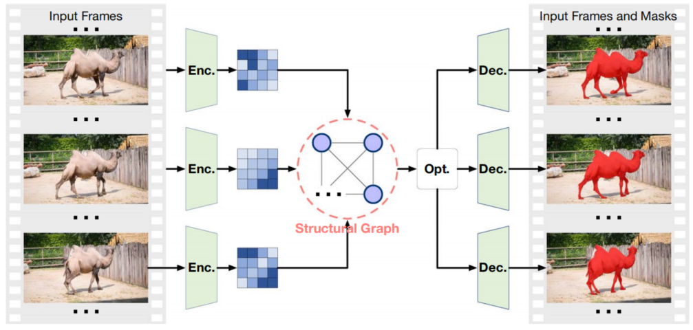
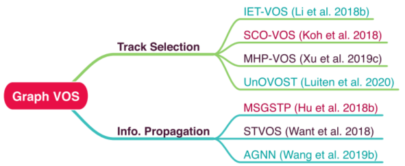
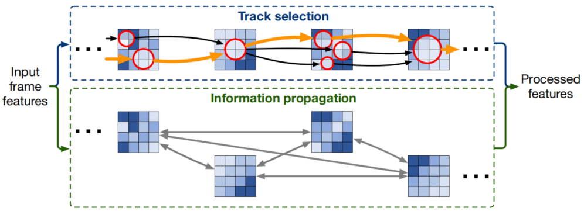
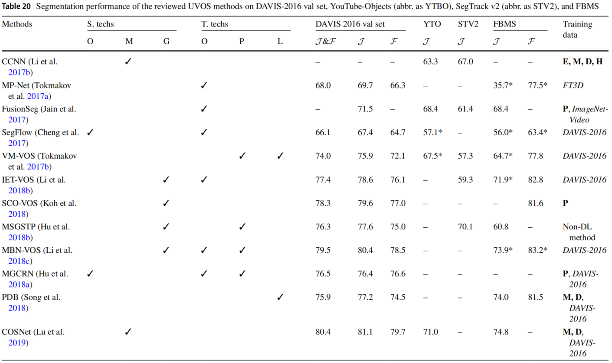
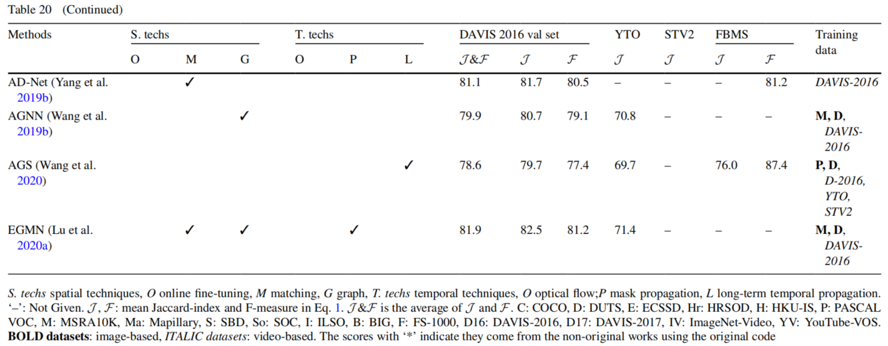

# Section 4. 方法

## Section 4.3. 基于图优化的VOS方法

直到2021年，大多数现有的VOS方法实现了基于在线精调和特征匹配的空间技术。然而，对于每一帧的分割，这两种技术只建立了同一视频中该帧与数目有限的其他帧之间的对应关系，这不足以处理经历巨大变化的对象。为了解决这个问题，基于图优化的技术被开发出来，这种技术将同一视频中的其他额外帧也包括进来，并且将它们组织成一个图结构。基于图分析与图优化，该技术可以获得帧之间更易理解和高层级的依赖关系，进一步促成了高质量的分割结果，详见图13所示。

图13. 基于图优化的VOS方法，可以同时适用于SVOS和UVOS。具体来说，这类方法将输入的特征（蓝色地图）组织成一个结构图，编码综合的全局上下文。然后，这个上下文被优化去生成最终分割的结果。

一般来说，有两类方法来组织和分析图节点：**轨迹选择**和**信息传播**，详见图14所示。给定一组输入帧，前者（Sect.4.3.1）检索整个视频中的最佳节点轨迹；后者（Sect.4.3.2）更多关注帧之间前景信息和背景信息的传播，获取全局上下文从而更好地分割。两者的区别如图15所示，讨论方法的总结（Sect.4.3.3）。

图14. 讨论的基于图优化的方法的发展路线图。蓝色、黑色和红色单词分别表示方法执行UVOS、SVOS和两者都行。

### 4.3.1 基于轨迹选择的方法

这类方法从一组连续帧中通过解析出最优的节点轨迹来执行VOS。具体来说，首先对输入帧进行编码；然后，如图15所示，从编码的特征中抽象出节点，并且逐帧连接起来；最后，从图中解析出最优的节点轨迹，并且将其解码为对象掩膜。本节介绍了有代表性的基于轨迹选择的工作，这些工作在表11a中作了简要的总结。

图15. 用于图节点组织和分析的两种技术示意图。在基于轨迹选择的方法中，超级像素或者对象建议被看作节点（红色圆圈），它们只与其他帧中的节点相连。连接的节点在整个序列中构成了一组轨迹。这种技术旨在从形成的轨迹（橙色和黑色箭头）中检索最优轨迹（橙色加粗箭头标示最优轨迹的例子）。最终的结果由最优轨迹上的节点构成。在基于信息传播的方法中，节点支持更多不同的连接（甚至同帧内的节点连接）。这种技术通过信息交互在节点之间建立一个高层级的并且综合的上下文（带有双向箭头的灰线）。最终的结果来自于空间特征和上下文信息。

表11a. 基于图优化（轨迹选择）的VOS方法汇总

| Year  | 会议  | 类型  | 论文标题、链接和缩写                                                                                                                                                                                                                    |                          代码                          | 节点实体     | 连结节点                       |
| :---: | :---: | :---: | --------------------------------------------------------------------------------------------------------------------------------------------------------------------------------------------------------------------------------------- | :----------------------------------------------------: | ------------ | ------------------------------ |
| 2018  | CVPR  |   U   | [Instance Embedding Transfer to Unsupervised Video Object Segmentation](https://openaccess.thecvf.com/content_cvpr_2018/papers/Li_Instance_Embedding_Transfer_CVPR_2018_paper.pdf) (IET-VOS)                                            |                                                        | 种子像素     | 节点来自于$I_{t-1}$和$I_{t+1}$ |
| 2018  | ECCV  |  S&U  | [Sequential Clique Optimization for Video Object Segmentation](https://openaccess.thecvf.com/content_ECCV_2018/papers/Yeong_Jun_Koh_Sequential_Clique_Optimization_ECCV_2018_paper.pdf) (SCO-VOS)                                       |                                                        | 对象掩膜     | 节点来自于所有其他帧           |
| 2019  | CVPR  |   S   | [MHP-VOS: Multiple Hypotheses Propagation for Video Object Segmentation](https://openaccess.thecvf.com/content_CVPR_2019/papers/Xu_MHP-VOS_Multiple_Hypotheses_Propagation_for_Video_Object_Segmentation_CVPR_2019_paper.pdf) (MHP-VOS) |   [Website](https://github.com/shuangjiexu/MHP-VOS)    | 包围盒       | 节点来自于$I_{t-1}$和$I_{t+1}$ |
| 2020  | WACV  |   U   | [UnOVOST: Unsupervised Offline Video Object Segmentation and Tracking](https://openaccess.thecvf.com/content_WACV_2020/papers/Luiten_UnOVOST_Unsupervised_Offline_Video_Object_Segmentation_and_Tracking_WACV_2020_paper.pdf) (UnOVOST) | [PyTorch](https://github.com/idilesenzulfikar/UNOVOST) | 对象轨迹片段 | 时间上的邻居和视觉相似节点     |

IET-VOS（Instance Embedding Transfer to UVOS）[^Li,2018b]是最早的基于轨迹选择的VOS方法之一。通过像素级的实例嵌入，该方法将局部稳定性像素和全局多样性像素作为种子像素，在整个视频中建立一组轨迹。具有最高累积的对象性和运动性得分的轨迹被选为最优轨迹，并且用于推导对象掩膜。讨论：由于采用了基于累积的策略，该方法可以有效地定位输入视频中频繁出现的对象。

SCO-VOS（Sequential Clique Optimization for VOS）[^Koh,2018]在对象掩膜（FCIS预测结果）上构建了一个k-部图。该方法通过定义在图节点上的能量函数最小化得出最佳掩膜轨迹。讨论：与IET-VOS不同的是，该方法考虑了对象级特征，这使得噪声中的分割更加稳健，但是需要额外的计算和更加复杂的优化。

MHP-VOS（Multiple Hypotheses Propagation for VOS）[^Xu,2019c]构建了树状结果以覆盖整个序列中所有可能的对象建议的轨迹。对于每个目标对象，该方法得出了一个具有最高空时一致性的轨迹。讨论：与其他图结构相比，树状结构更加适用于SVOS，因为它对早期帧生成了假设较少，对后期帧生成的假设较多，这与传播掩膜的置信度随着时间衰减的行为是一致的。

UnOVOST（Unsupervised Offline Video Object Segmentation and Tracking）[^Luiten,2020]实现了与MHP-VOS类似的方法。不同的是，该方法用轨迹片段（tracklet, 感举的目标对象存在的一组连续帧）代替对象建议作为节点，其中每个轨迹片段是一个时空一致的对象建议轨迹。讨论：与MHP-VOS相比，UnOVOST中涉及的节点较少，减轻了轨迹选择的工作量。而且，由于融合了实例级分割模块，该方法支持多对象UVOS。

### 4.3.2 基于信息传播的方法

信息传播是实现基于图优化的VOS的另一种技术。这种技术通过在节点之间传播语义信息来建立目标对象和背景的综合上下文。建立的上下文为稳健的分割提供了更多的判别性特征。表11b简要地汇总了讨论过的方法。

表11b. 基于图优化（信息传播）的VOS方法汇总

| Year  | 会议  | 类型  | 论文标题、链接和缩写                                                                                                                                                                                                                      |                           代码                           | 节点实体 | 连结节点                                                                                           |
| :---: | :---: | :---: | ----------------------------------------------------------------------------------------------------------------------------------------------------------------------------------------------------------------------------------------- | :------------------------------------------------------: | -------- | -------------------------------------------------------------------------------------------------- |
| 2018  | ECCV  |   U   | [Unsupervised Video Object Segmentation using Motion Saliency-Guided Spatio-Temporal Propagation](https://openaccess.thecvf.com/content_ECCV_2018/papers/Yuan-Ting_Hu_Unsupervised_Video_Object_ECCV_2018_paper.pdf) (MSGSTP)             | [Website](https://sites.google.com/view/unsupervisedvos) | 超级像素 | 节点来自于$[I_{t-15},I_{t+15}]$                                                                    |
| 2018  | TPAMI |   S   | [Semi-Supervised Video Object Segmentation with Super-Trajectories](https://ieeexplore.ieee.org/abstract/document/8325298) (STVOS)                                                                                                        |                                                          | 超级像素 | 节点来自于$I_{t-1}$和$I_{t+1}$                                                                     |
| 2019  | CVPR  |   U   | [Zero-Shot Video Object Segmentation via Attentive Graph Neural Networks](https://openaccess.thecvf.com/content_ICCV_2019/papers/Wang_Zero-Shot_Video_Object_Segmentation_via_Attentive_Graph_Neural_Networks_ICCV_2019_paper.pdf) (AGNN) |      [PyTorch](https://github.com/carrierlxk/AGNN)       | 视频帧   | 节点来自于$\{\dots,I_{t-2N},I_{t-N},I_t,I_{t+N},I_{t+2N},\dots,\}$，其中$N=T/5$，$T$表示视频的长度 |

MSGSTP（Motion Saliency-Guided Spatio-Temporal Propagation）[^Hu,2018b]在超级像素之间建立了帧内、帧间和长时距离连接。随着连接的建立，该方法传播了最初的运动显著性用于获得输出对象的掩膜。讨论：虽然MSGSTP不是基于深度学习的方法，但是基于图优化的信息传播的想法是有启发性的，并且值得讨论。此外，该方法也取得了相比其他基于深度学习具有竞争力的结果，这进一步证明了基于图优化思想的价值，详见表20所示。

STVOS（Super-Trajectories for VOS）[^Wang,2018]沿着超级轨迹传播标注的标签来执行SVOS，该轨迹将连续帧的像素集连接起来。与MSGSTP不同的是，MSGSTP只根据空间特征判别超级像素，而STVOS还在分组像素时考虑运动线索，从而实现可靠的时间一致性。讨论：STVOS也是一种非深度学习的方法（MSGSTP和STVOS是本文中惟一的两种非深度学习方法）。然而，STVOS的分割结果表明，点轨迹作为一种早期的VOS技术，如果设计得当仍然可以发挥很好的作用。随着深度特征描述符的发展，相邻基于轨迹的方法可以得到进一步的改进。

AGNN（Attentive Graph Neural Network）[^Wang,2019b]在输入序列的一个子集上构建了一个全连接图。在推理过程中，该方法迭代地执行信息传播，为所有涉及的节点实现全局性的上下文。讨论：与上述方法不同，AGNN将视频帧视为节点，对其进行更加综合的特征编码以建立高层次的依赖关系。然而，信息传播和汇总的效率随着参与节点数量的增加而下降，这就限制了性能的进一步提升。

### 4.3.3 基于图优化的VOS方法总结

在本节中，介绍了几种具有代表性的基于图形优化的方法。与在线精调和特征匹配不同的是，这种技术考虑了更多帧来建立整个序列的广泛对应关系。因此，基于图优化的VOS方法可以更好地定位原始视频中经常出现的对象，在UVOS中取得有竞争力的结果（如表20所示）。

在VOS方法中主要有两种模式来组织和分析图数据：⑴轨迹选择；⑵信息传播。基于轨迹选择的模式将节点组织成一组轨迹或者树，从中检索出最优轨迹以生成对象掩膜。早期的方法（IET-VOS）仅嵌入像素级特征来构建轨迹，这很容易受到背景噪声的影响。因此，随后的方法（SCO-VOS、MHP-VOS和UnOVOST）考虑了对象建议/轨迹，以实现稳健地轨迹生成和选择。然而，这些方法需要额外的网络（如：Mask R-CNN或FCIS）去生成对象建议，增加了网络参数和计算成本。

与轨迹选择不同的是，基于信息传播的模式通过迭代信息传播来辅助VOS。早期方法（MSGSTP、STVOS）主要传播标签相关的信息（如：运行显著性或标注标签）使得分割结果对于节点之间的连接性更加敏感。最近的工作（AGNN）由于考虑了深度特征帧级别信息传播，从而缓解了这个问题。总而言之，图优化给VOS方法带来了更加广泛的对应关系，使得高质量的分割结果成为可能（尤其是在UVOS中）。然而，由于图优化的高计算复杂性（无论是基于轨迹选择还是基于信息传播的方案），这种良好的结果是以分割效率为代价的。因此，眼前基于图形优化的方法不适合于实时的和资源有限的VOS任务。

表20. 在DAVIS-2016验证集和YouTube-Objects、SegTrack v2和FBMS上回顾的UVOS方法的分割性能

