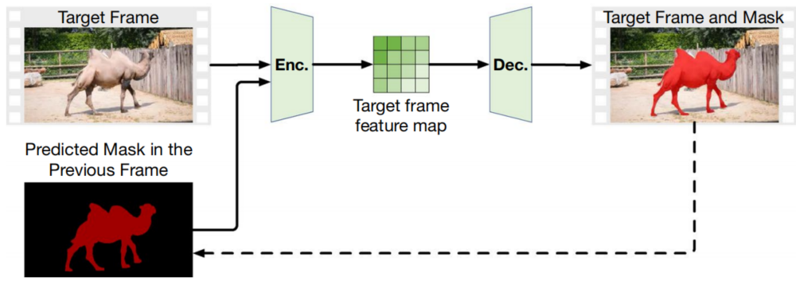

# Section 4. 方法

## Section 4.5. 基于掩膜传播的VOS方法

本节讨论了基于掩膜传播的代表性方法。这类方法假定目标对象在整个输入序列中平稳地移动。因此，在前一帧预测的掩膜可以很好地估计目标对象的位置和形状。有了这样的估计，这类方法可以更加关注目标对象最可能出现的区域。与光流方法不同，掩膜传播法更好地适用动态背景的序列。表3、表4和表5显示，大多数现有方法是基于这种技术建立的。

图18. 基于掩膜传播的VOS方法（仅应用于SVOS）示意图。在推理阶段，分割网络将目标帧和先前帧的掩膜作为输入，预测目标帧的对象掩膜。推理之后，传播预测的掩膜用于后续帧的分割（带箭头的虚线）

图18显示了基于掩膜传播的VOS方法的示意图。在掩膜追踪（Mask-Track）[^Perazzi,2017]中，首先提出了基于深度学习的SVOS的掩膜传播（Sect. 4.5.1），将前一帧预测的掩膜直接送入分割网络进行掩膜生成。为了进一步提升分割性能，最近的方法加入了其他有价值的技术（如：光流、双向传播、强化学习）以提升传播掩膜的置信度，使得分割网络能够集中在更加合理的区域。这些方法将在Sect.4.5.2介绍。Sect.4.5.3汇总了讨论的方法。表13简要地汇总了相关的方法。图19展示了讨论方法的开发路线图。

图19. 基于掩膜传播的VOS方法发展路线图。MaskTrack是第一个在SVOS中使用掩膜传播的方法。其后，在MaskTrack的基础上提出了几种方法以进一步改进性能。对于MaskTrack的改进使用添加了“+”的粗体单词表示。

| Years | 会议 | 类型 | 论文标题、链接和缩写                                         |                             代码                             | 方向 | 掩膜精调             | 关注区域                                     |
| :---: | :--: | :--: | ------------------------------------------------------------ | :----------------------------------------------------------: | ---- | -------------------- | -------------------------------------------- |
| 2017  | CVPR |  S   | [Learning Video Object Segmentation from Static Images](https://openaccess.thecvf.com/content_cvpr_2017/papers/Perazzi_Learning_Video_Object_CVPR_2017_paper.pdf) (MaskTrack) | [Website](https://fperazzi.github.io/projects/masktrack/index.html) | 前向 | -                    | 全局目标帧                                   |
| 2017  | CVPR |  S   | [Online Video Object Segmentation via Convolutional Trident Network](https://openaccess.thecvf.com/content_cvpr_2017/papers/Jang_Online_Video_Object_CVPR_2017_paper.pdf) (CTN) | [Website](http://mcl.korea.ac.kr/~dotol1216/CVPR2017_CTN/index.html) | 前向 | 基于光流的包装       | 精调掩膜的包围盒                             |
| 2018  | CVPR |  S   | [Motion-Guided Cascaded Refinement Network for Video Object Segmentation](https://openaccess.thecvf.com/content_cvpr_2018/CameraReady/0391.pdf) (MGCRN) |                                                              | 前向 | 基于光流的轮廓演化   | 全局目标帧                                   |
| 2018  | CVPR |  S   | [Reinforcement Cutting-Agent Learning for Video Object Segmentation](https://openaccess.thecvf.com/content_cvpr_2018/papers/Han_Reinforcement_Cutting-Agent_Learning_CVPR_2018_paper.pdf) (RCAL-VOS) |                                                              | 双向 | 基于光流的包装       | 精调掩膜的包围盒                             |
| 2018  | ECCV |  S   | [Video Object Segmentation with Joint Re-identification and Attention-Aware Mask Propagation](https://openaccess.thecvf.com/content_ECCV_2018/papers/Xiaoxiao_Li_Video_Object_Segmentation_ECCV_2018_paper.pdf) (Dye-Net) |                                                              | 前向 | 基于强化学习的再定位 | 包含对象和周围的环境的包围盒由传播的掩膜生成 |

“方向”就是掩膜传播方向。“关注区域”表示由分割网络显式关注的目标帧区域。请注意，“全局目标帧”意味着传播的掩膜隐匿地指导了分割。

### 4.5.1 掩膜追踪

MaskTrack是第一个基于掩膜传播的SVOS方法。如图18所示，分割网络将一个有四个通道（当前帧掩膜+前一帧掩膜）的张量作为输入，预测每个目标帧的对象掩膜。讨论：虽然获取竞争结果，MaskTrack不能处理经历了突然变化或者遮挡的对象，因为前一帧的失败掩膜无法提供正确的估计。因此，它的大部分扩展工作都聚集于如何提升这种估计的置信度。

### 4.5.2 基于掩膜的扩展

CTN（Convolutional Trident Network，卷积三叉线网络）[^Jang&Kim,2017]将当前的掩膜自适应于前一帧。对于每个像素$\mathbf{p}=[x,y]^T$，其标签$H^t(\mathbf{p})$来自于前一帧的标签和帧之间的光流图：
$$
H^t(\mathbf{p})=S^{t-1}(x+u_b^t(\mathbf{p}),y+v_b^t(\mathbf{p}))
$$
其中，$S^{t-1}$是前一帧的掩膜，$u_b^t(\mathbf{p}),v_b^t(\mathbf{p})$是像素$\mathbf{p}$的光流向量。讨论：与MaskTrack不同的是，CTN单独精调背景掩膜和背景掩膜。通过了光流的掩膜自适应，未来的变化可以被更好地处理。

MGCRN（Motion-Guided Cascaded Refine Network）[^Hu,2018a]也是利用光流精调前一帧的掩膜。与CTN不同，MGCRN利用主动轮廓（Active Contours）[^Chan&Vese,2001]迭代地估计对象轮廓，其中初始轮廓来自于前面的掩膜。讨论：由于主动轮廓的性质，估计主要聚集在前一帧中目标对象附近的区域，抑制背景对象的干扰。

DyeNet[^Li&ChangeLoy2018]由于其是基于ROI的匹配，所以在Sect.4.2.2中讨论过。此外，DyeNet实现了双向掩膜传播。为此，DyeNet从输入序列中预测出一组高置信度的掩膜，然后将它们双向传播到其余的帧。讨论：与其他方法不同，DyeNet在有严重遮挡或者变形的序列上表现得更好，因为在某些情况下，反向传播的掩膜可能更好地估计了目标对象的形状和位置。

RCAL-VOS（Reinforcement Cutting-Agent Learning for VOS）[^Han,2018]实现两个基于强化学习的网络（CPN: Cutting-Policy Network, CEN: Cutting-Execution Network），它们被训练用来预测一组动作（如：向上或向下、向左或向右；缩小或扩大；比例缩放；停止）。讨论：与其他方法不同，该方法不需要光流对掩膜精调。而且，该方法还证明了目标对象周围的对比信息有助于输出高质量的结果。

### 4.5.3 基于掩膜传播方法的总结

本节讨论了几种基于掩膜传播的代表性方法，这种方法源于MaskTrack。有了底层的形状和位置先验，可以引导分割网络更多地关注对象区域，并且得出高质量的结果。然而，仍然存在一些影响VOS性能的因素：⑴严重的变形；⑵突然运动和遮蔽。当这些因素出现后，先前帧的掩膜一般不能估计出目标对象的潜在形状和位置。因此，一些扩展性的工作被提出来以提升传播掩膜的置信度。

CTN和MGCRN基于光流改进了传播的掩膜，提供了运动线索从而自适应了帧之间的变化。虽然MaskTrack也考虑了光流，但是在扩展中使用了更加直接的方法来精调传播的掩膜。然而，这些方法仍然不能很好地处理遮蔽与突然运动。为了解决这个问题，双向掩膜传播（DyeNet）被提出来。一些遮蔽——重现的对象可以通过反向掩膜传播为VOS做出贡献。RCAL-VOS实现了基于深度强化学习的方法来生成潜在目标区域。在没有用于光流的深度网络条件下，RCAL-VOS学习了一个策略，从而自动适应将掩膜传播到目标帧。

从表3、表4和表5中可知，大多数现有的方法都考虑了在VOS中使用掩膜传播。因为实现传播的方式类似，这里只讨论了一种有代表性的方法。掩膜传播对于早期的方法贡献较大，因为它能提供隐含的位置和形状先验。在最近基于特征匹配的SVOS方法中，传播的掩膜一直是描述概率的重要数据，这个概率指明了参考点属于目标对象还是背景。
