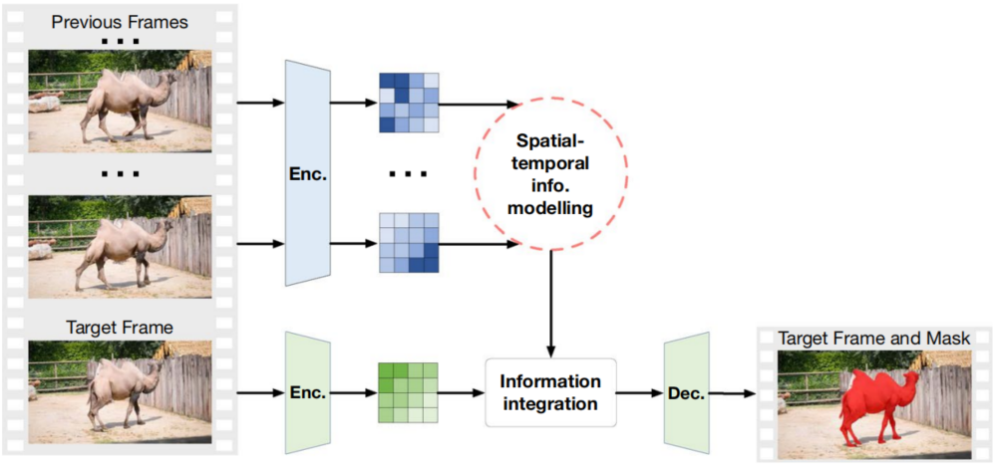
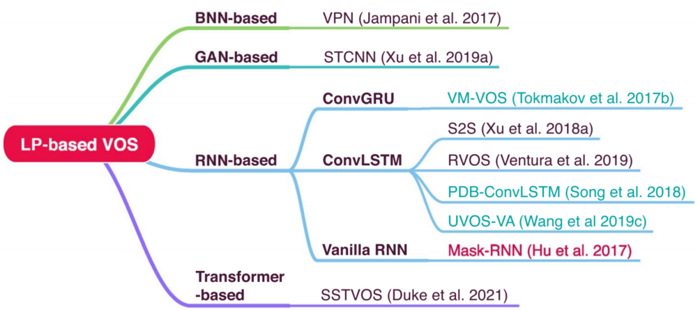
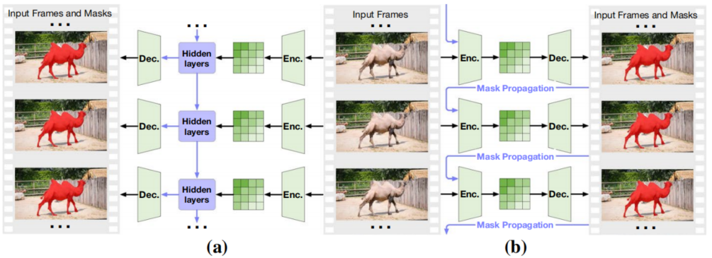
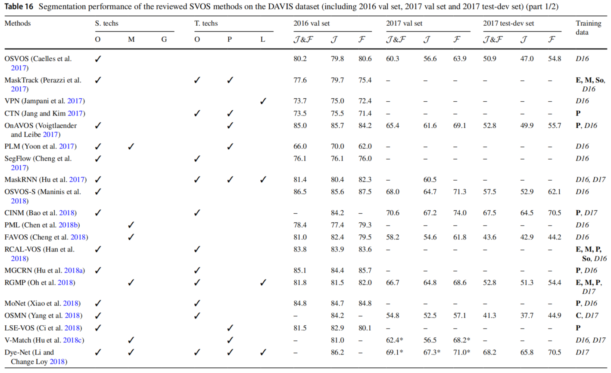
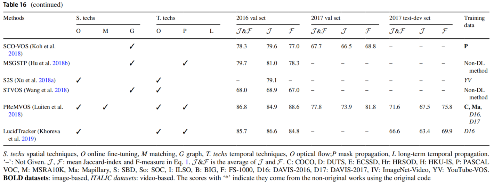
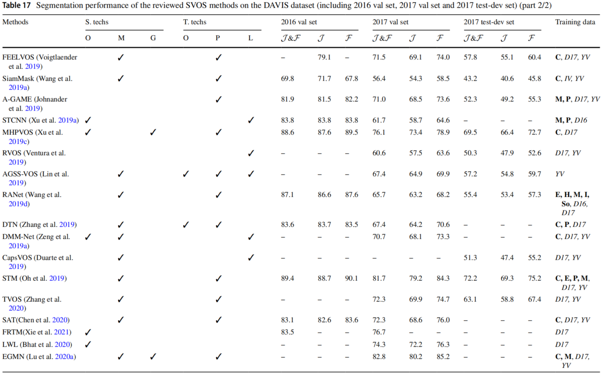
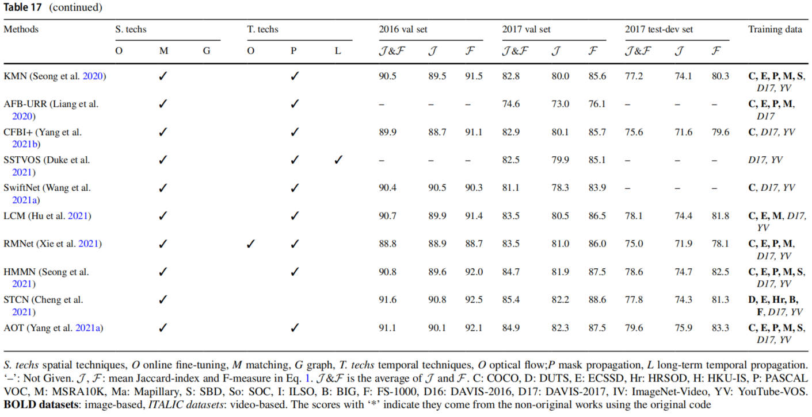
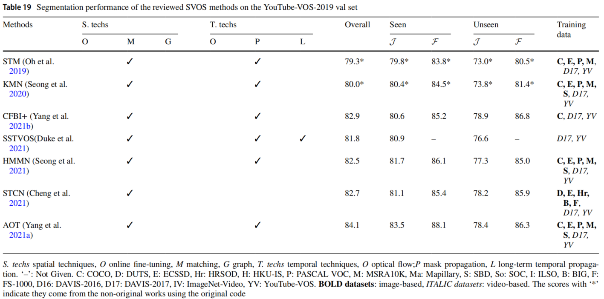

## Section 4.6. 基于长时时间传播的VOS方法

前两节讨论了基于光流和掩膜传播的VOS方法，这些方法只关注短时时间对应关系，并且为目标对象生成隐匿的对象位置和形状。对视觉特征的依赖较少，使这些方法能够处理具有视觉混淆背景。然而，在对具有动态背景或者严重遮挡的序列进行分割时，仅有短时时间线索是不足以获得高质量结果的。为了解决这些问题，基于长时时间信息的方法提了出来。这些方法从相对较长的视频片段中积累了时空线索，隐匿地编码了与目标对象和背景相关的动态属性，如：外观、比例、位置和形状。因此，分割网络可以自适应这些变化，并且取得更好的结果。

图20展示了这个方法的示意图。根据时空信息的提取和利用技术，所讨论的方法主要可以分为三类：⑴基于双边神经网络（BNN）方法（Sect.4.6.1）；⑵基于生成式对抗网络（GAN）方法（Sect.4.6.2）；⑶基于循环神经网络（RNN）方法（Sect.4.6.3）；⑷基于Transformers方法（Sect.4.6.4）。Sect.4.5.6总结了讨论的方法，图21展示了发展路线图。表14说明了这些方法之间的简要比较。

图20. 基于长时时间传播的VOS方法示意图，它同时适用于SVOS和UVOS。对于每个目标帧，编码特征和从一组过去帧传播的特征被整合起来用于生成掩膜。请注意，在某些情况下，目标帧和过去帧的编码器是不同的，因此它们以不同的颜色突出显示。

图21. 基于长时时间信息传播的VOS方法（缩写为“基于LP的VOS方法”）的发展路线图。基于时空信息提取技术，所列方法分为三类：基于BNN方法、基于GAN方法和基于RNN方法。注意图中标注为蓝色和黑色分别表示UVOS方法和SVOS方法，标注为红色的则同时满足两种方法。

### 4.6.1 基于 BNN 的 VOS 方法

VPN（Video Propagatin Networks）[^Jampani,2017]是最早基于长时时间传播的深度方法之一。传播是通过双边神经网络实现的，输入帧和掩膜被转换成双边空间，然后在整个输入空间过滤得到时间传播。讨论：由于BNN中的稠密连接，VPN可以获得比传统VOS方法更加全面的信息传播。然而，双边神经网络只是将原始帧作为输入，限制了更高层次的信息传播和性能的进一步提升。

表14. 基于长时时间信息传播之BNN的方法汇总

| Years | 会议  | 类型  | 论文标题、链接和缩写                                                                                                                              |                             代码                             | 帧的数目 | 方向 | 时空信息     |
| :---: | :---: | :---: | ------------------------------------------------------------------------------------------------------------------------------------------------- | :----------------------------------------------------------: | -------- | ---- | ------------ |
| 2017  | CVPR  |   S   | [Video Propagation Networks](https://openaccess.thecvf.com/content_cvpr_2017/papers/Jampani_Video_Propagation_Networks_CVPR_2017_paper.pdf) (VPN) | [Caffe](https://github.com/varunjampani/video_prop_networks) | 9/t-1    | 前向 | 双向过滤响应 |

“帧的数目”：在训练/推理阶段包含的帧的数目；T: 视频长度；t: 目标帧的索引；NG: 没有给出。“方向”：时间信息传播方向。“时空信息”：长时时空信息的数据表示方法

### 4.6.2 基于 GAN 的 VOS 方法

 除了BNN，GAN也可以用于VOS。STCNN[^Xu,2019a]实现了一个帧生成模块，它根据之前的四个帧预测目标帧的情况。该模块以对抗性方式训练，隐匿地学习时间信息的传播和累积。讨论：有竞争力的结果表明基于GAN的技术在VOS上的有效性。由于STCNN只考虑了四帧的累积，因此未来建议在长时分析上更多研究。

表14. 基于长时时间信息传播之GAN的方法汇总

| Years | 会议  | 类型  | 论文标题、链接和缩写                                                                                                                                                                       |                       代码                        | 帧的数目 | 方向 | 时空信息             |
| :---: | :---: | :---: | ------------------------------------------------------------------------------------------------------------------------------------------------------------------------------------------ | :-----------------------------------------------: | -------- | ---- | -------------------- |
| 2019  | CVPR  |   S   | [Spatiotemporal CNN for Video Object Segmentation](https://openaccess.thecvf.com/content_CVPR_2019/papers/Xu_Spatiotemporal_CNN_for_Video_Object_Segmentation_CVPR_2019_paper.pdf) (STCNN) | [PyTorch](https://github.com/longyin880815/STCNN) | 4/4      | 前向 | 帧生成分支的中间输出 |

### 4.6.3 基于 RNN 的 VOS 方法

许多在时空信息模型中使用RNN的工作被提出来解决VOS问题。直到现在共有三类：ConvGRU[^Ballas,2016]、ConvLSTM[^Shi,2015b]以及循环连接网络。前两种RNN是GRU和LSTM的卷积版本，而最后一种是通过循环连接分割网络建立的，用BPTT（Back Propagation Through Time，通过时间反向传播）[^Werbos,1990]进行训练。图22展示了基于经典RNN和基于循环连接网络实现VOS方法的区别。

图22. 基于经典RNN（图22a）和基于循环连接网络（图22b）的VOS方法的区别。前者的隐藏层中整合了当前帧的特征和从过去帧传播来的时空信息，然后对产生的隐藏状态解码输出预测结果。后者通过掩膜传播将当前帧和过去的分割连接起来，每次预测结果都包含了分割网络的一部分。在训练过程中，计算和累积的损失更新了网络参数。在Sect.4.5中讨论的方法不会跨帧累积损失，而与其不同的是图示的方法可以很好地处理误差传播。

1. 基于Conv-GRU的方法。
   1. VM-VOS（Visual Memory for VOS）[^Tokmakov,2017b]实现了双向Conv-GRU模块。与前面提及的方法不同，VM-VOS通过双向（前向与反向）累积与传播外观和运动信息（光流）。讨论：由于同时考虑了空间和时间特征，VM-VOS可以编码更加全面的上下文去处理视频序列中剧烈的变形和遮挡信息。
2. 基于Conv-LSTM的方法。
   1. S2S（Sequence-to-Sequence）[^Xu,2018a]使用一个简单但是有效的Conv-LSTM模块执行SVOS，其结构类似于图22a所示。给定第一帧的标注，S2S对标注对象的特征进行编码，并在整个输入序列中传播。讨论：S2S是在YouTube-VOS上训练的一个基线方法。其结果显示，大规模和长时的视频数据集激活基于长时时空信息建模的VOS方法。
   2. RVOS（Recurrent network for VOS）[^Ventura,2019]通过传播空间和时间域的信息扩展了S2S。与S2S不同的是，RVOS将每个对象视为一个累积了帧间与帧内对象时空特征的实体。讨论：通过对象层面的特征传播，RVOS可以编码更加全面的时空依赖关系，因此可以处理具有复杂场景和多个目标对象的序列。
   3. PDB（Pyramid Dilated Bidirectional Conv-LSTM）[^Song,2018]实现了一个具有PDC（Pyramid Dilated Convolution，金字塔膨胀卷积）和双向传播的Conv-LSTM。与其他模型不同的是，该方法为得到全面的空间特征在骨架模块和Conv-LSTM模块中都应用了PDC，这些空间特征基于不同的膨胀率在两个方向上传播。讨论：由于多尺度和双向特征传播，PDB在帧之间编码了更深层次的时空关系，在有挑战性的序列上得到了有竞争力的结果。
   4. AGS（Attention Guided-Segmentation）[^Wang,2019c]以从粗到细的机制执行UVOS，其中粗略的注意力图是由基于Conv-LSTM的模块预测出来的，然后进行细化，得出最终结果。讨论：与上述方法不同的是，AGS证明了即使是具有粗略标注的数据集（用人类眼动记录生成）也能使UVOS系统取得有竞争力的结果。这样的结论在扩展性工作[^Wang,2020]中得到进一步验证。由于粗略标注所需的成本较低，在未来的工作中可以考虑使用更多的序列来改进成果。
3. 基于循环连接网络的方法。
   1. MaskRNN[^Hu,2017]通过循环连接分割网络的复制实现了RNN架构。如图22b所示，连接通过掩膜传播建立。讨论：MaskRNN和基于掩膜传播的方法之间的主要区别是，MaskRNN可以在训练期间累积跨帧的损失（通过时间的反向传播）[^Werbos,1990]。因此，该网络可以伴随着更少的误差传播来更好地处理序列推理。

表14. 基于长时时间信息传播之RNN的方法汇总

| Years |  会议   | 类型  | 论文标题、链接和缩写                                                                                                                                                                                                                       |                            代码                             | 帧的数目 | 方向 | 时空信息                                     |
| :---: | :-----: | :---: | ------------------------------------------------------------------------------------------------------------------------------------------------------------------------------------------------------------------------------------------ | :---------------------------------------------------------: | -------- | ---- | -------------------------------------------- |
| 2017  |  CVPR   |   U   | [Learning Video Object Segmentation with Visual Memory](https://openaccess.thecvf.com/content_ICCV_2017/papers/Tokmakov_Learning_Video_Object_ICCV_2017_paper.pdf) (VM-VOS)                                                                |      [Website](http://lear.inrialpes.fr/research/lvo/)      | NG/T-1   | 双向 | 前向和反向隐藏状态的拼接                     |
| 2017  | NeurIPS |  S&U  | [MaskRNN: Instance Level Video Object Segmentation](https://proceedings.neurips.cc/paper/2017/file/6c9882bbac1c7093bd25041881277658-Paper.pdf) (MaskRNN)                                                                                   | [Website](https://sites.google.com/view/yuantinghu/maskrnn) | 7/t-1    | 前向 | 二进制对象掩膜                               |
| 2018  |  ECCV   |   S   | [YouTube-VOS: Sequence-to-Sequence Video Object Segmentation](https://openaccess.thecvf.com/content_ECCV_2018/papers/Ning_Xu_YouTube-VOS_Sequence-to-Sequence_Video_ECCV_2018_paper.pdf) (S2S)                                             |                                                             | <10/T-1  | 前向 | 前向隐藏状态                                 |
| 2019  |  CVPR   |   S   | Rvos: End-to-end recurrent network for video object segmentation（RVOS）                                                                                                                                                                   |                                                             | 4/T-1    | 前向 | 前向隐藏状态（整个交叉帧和内部帧的序列线索） |
| 2018  |  ECCV   |   U   | [Pyramid Dilated Deeper ConvLSTM for Video Salient Object Detection](https://openaccess.thecvf.com/content_ECCV_2018/papers/Hongmei_Song_Pseudo_Pyramid_Deeper_ECCV_2018_paper.pdf) (PDB)                                                  |    [Caffe](https://github.com/shenjianbing/PDB-ConvLSTM)    | 4/T-1    | 双向 | 前向和反向隐藏状态的求和                     |
| 2019  |  CVPR   |   U   | [Learning Unsupervised Video Object Segmentation through Visual Attention](https://openaccess.thecvf.com/content_CVPR_2019/papers/Wang_Learning_Unsupervised_Video_Object_Segmentation_Through_Visual_Attention_CVPR_2019_paper.pdf) (AGS) |         [Caffe](https://github.com/wenguanwang/AGS)         | <2/t-1   | 前向 | 前向隐藏状态                                 |

### 4.6.4 基于Transformer 的 VOS 方法

Transformers在最近的计算机视觉任务中被广泛探索[^Carion,2020][^Wang,2021c]。因为Transformers可以对长距离的依赖关系建模，它们自然地适用于视频相关的应用。SSTVOS（Sparse Spatiotemporal Transformers for VOS）[^Duke,2021]是最早的基于Transformers的SVOS方法之一。方法将需要分割的帧和几个过去的帧作为输入，并且对它们的时空注意力和匹配度进行编码，从而生成掩膜。为了提高分割效率，SSTVOS为计算注意力图实现了稀疏模式。讨论：与本节中其他方法不同，SSTVOS对输入帧的处理不再是顺序的，而是并联的，这在一定程度上减轻了漂移误差。然而，受计算资源的限制，SSTVOS在推理过程中只考虑了三个过去帧，未能充分地利用帧之间的长距离依赖关系。

表14. 基于长时时间信息传播之Transformer的方法汇总

| Years | 会议  | 类型  | 论文标题、链接和缩写                                                                                                                                                                                                                        |                    代码                     | 帧的数目 | 方向   | 时空信息     |
| :---: | :---: | :---: | ------------------------------------------------------------------------------------------------------------------------------------------------------------------------------------------------------------------------------------------- | :-----------------------------------------: | -------- | ------ | ------------ |
| 2021  | CVPR  |   S   | [SSTVOS: Sparse Spatiotemporal Transformers for Video Object Segmentation](https://openaccess.thecvf.com/content/CVPR2021/papers/Duke_SSTVOS_Sparse_Spatiotemporal_Transformers_for_Video_Object_Segmentation_CVPR_2021_paper.pdf) (SSTVOS) | [Website](https://github.com/dukebw/SSTVOS) | NG/3     | 无方向 | 时空注意力图 |

### 4.6.5 基于长时时间传播的VOS方法小结

本节讨论了基于长时时间传播的VOS方法，这些方法累积了一个时间周期内的时空特征，隐含地编码了对象与背景的趋势。为了实现这种编码，当前共有四种技术类型：BNN是最早的技术之一，VPN使用BNN从过去帧中累积时空特征。除了BNN，基于GAN的方法（STCNN）也在几个VOS基准上表现良好。长时信息被隐含地嵌入到一个帧生成分支中。基于RNN的VOS方法提出，是因为Conv-GRU和Conv-LSTM在基准上的良好表现。早期的方法（VM-VOS、S2S）建立了标准的管道来执行具有长时信息传播的VOS。PDB通过纳入多尺度特征嵌入和双向传播实现了进一步的改进。为了促进多个对象的分割，RVOS同时支持帧之间的时间对应关系和对象之间的空间关系，从而提升了多对象分割的性能。AGS实现了从粗到细的策略，并且验证了即使是具有粗略标注的数据集也能促进学习长时时间对应关系。上述所有的方法都需要一个特定的模块来进行长时预测，这种信息累积方式非常耗时，因此这类模块通常运行缓慢。因此，许多方法（MaskRNN）只将预测的掩膜传播到后续的帧。

从表16、表17、表19和表20中可知，长时传播在最近的方法中很少使用，而且它也没有带来比其他方法更好的结果，即使在长时VOS基准（YouTube-VOS，表19）上来看也是如此。因此，长时传播对VOS的贡献并没有预期那么大，原因可以用表14来解释。该表显示，所讨论的方法在推理过程中累积了所有先前帧的时空信息。然而，由于计算成本的限制，在训练过程中只使用了有限的帧数。因此，现有的方法在很大程度上仍然是通过短时视频帧进行训练，这使得它们在某些情况下无法取得理想的结果。尽管基于Transformers的方法已经大大改善了VOS的性能，但是它仍然严重依赖帧短时时间相关性。未来的研究依然是有限资源下学习长时信息传播。

表16. 在DAVIS数据集（包括：2016验证集、2017验证集、2017测试-开发集）回顾的SVOS方法的分割性能

S.techs: 空间技术；O: 在线精调；M: 匹配技术；G: 图模型；T.techs: 时间技术；O: 光流；P: 掩膜传播；L: 长时时间传播；‘-’: 没有给出；$\mathcal{J,F}$: Jaccard指数和F-测度的均值（参见等式1）；$\mathcal{J}\&\mathcal{F}$: $\mathcal{J}$和$\mathcal{F}$的均值；C: COCO；D: DUTS；E: ECSSD；Hr: HRSOD；H: HKU-IS；P: PASCAL VOC；M: MSRA10K；Ma: Mapillary；S: SBD；So: SOC；I: ILSO；B: BIG；F: FS-1000；D16：DAVIS-2016；D17：DAVIS-2017；IV: ImageNet-Video；YV: YouTube-VOS；**粗体字数据集**：基于图像的；*斜体字数据集*：基于视频的；带星号的得分表示使用原始代码但是并非原始工作成果。

表17. 在DAVIS数据集（包括：2016验证集、2017验证集、2017测试-开发集）回顾的SVOS方法的分割性能

S.techs: 空间技术；O: 在线精调；M: 匹配技术；G: 图模型；T.techs: 时间技术；O: 光流；P: 掩膜传播；L: 长时时间传播；‘-’: 没有给出；$\mathcal{J,F}$: Jaccard指数和F-测度的均值（参见等式1）；$\mathcal{J}\&\mathcal{F}$: $\mathcal{J}$和$\mathcal{F}$的均值；C: COCO；D: DUTS；E: ECSSD；Hr: HRSOD；H: HKU-IS；P: PASCAL VOC；M: MSRA10K；Ma: Mapillary；S: SBD；So: SOC；I: ILSO；B: BIG；F: FS-1000；D16：DAVIS-2016；D17：DAVIS-2017；IV: ImageNet-Video；YV: YouTube-VOS；**粗体字数据集**：基于图像的；*斜体字数据集*：基于视频的；带星号的得分表示使用原始代码但是并非原始工作成果。

表19. 在YouTube-VOS 2019验证集上回顾的SVOS的分割性能

