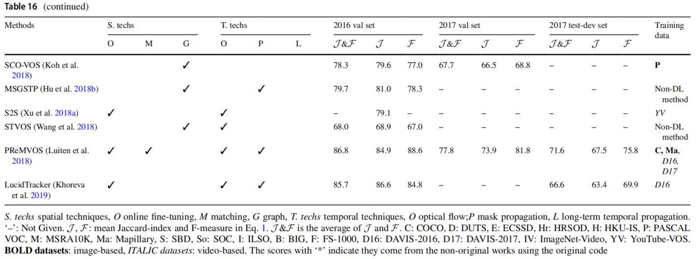
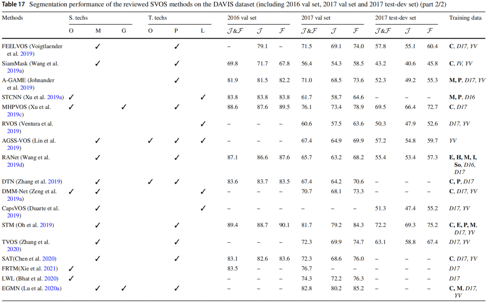
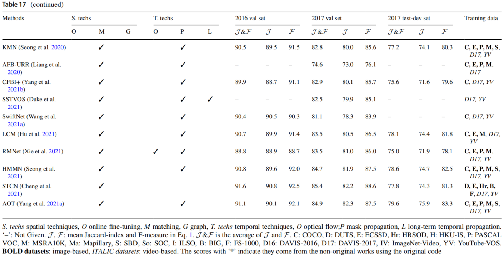
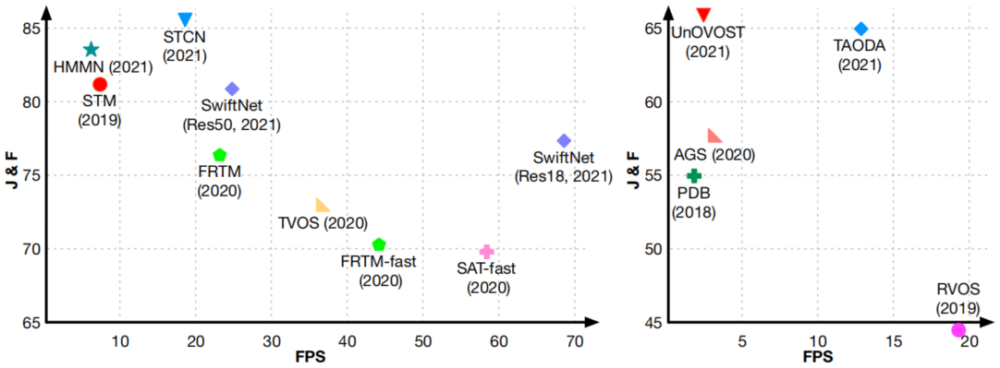

# Section 5. 实验结果与讨论

上一节根据利用时空特征技术的不同讨论了当前的VOS方法。为了更好地理解这些技术的形成过程，并且进行公平地比较，我们在相同的实验设置下测试了一些有代表性的VOS方法。定量与定性的结果，以及理论分析都有助于为这些方法的给出结论。此外，所有在几个基准数据集上回顾的方法的分割得分，也进一步支持了结论。最后，我们概述了这个领域可能的研究趋势。

## 5.1 定量与定性的结果

在本节中，回顾的方法基于分割的效率和准确性两个方法进行了讨论。为了在计算机效率上进行公平的比较，9个代表性的SVOS方法在DAVIS-2016数据集上进行评估，该数据集包括：20个视频序列、1475个帧。选择的方法包括：OSVOS（在线精调）、MaskTrack（在线精调、掩膜传播）、RGMP（匹配、掩膜传播、长距离传播）、STM（匹配、掩膜传播）、RANet（匹配、掩膜传播）、SiamMask（匹配、掩膜传播）、OSMN（在线精调的变体、掩膜传播）、A-GAME（在线精调的变体、掩膜传播）、RVOS（长距离传播）。评估单个Nvidia GeForce RTX 2080Ti GPU上完成。

表15描述了在DAVIS-2016上代表性方法的平均准确性和FPS。此外，还列出了被认为对效率有重要意义的几个属性，包括：时空技术的应用、包含的帧、输入帧的分辨率。表16、表17、表19描述了在四个基准数据集（DAVIS-2016验证集、DAVIS-2017验证集、DAVIS-2017测试开发集和YouTube-VOS测试集）上回顾的SVOS方法的定量结果。表20描述了在四个基准数据集（DAVIS-2016验证集、YouTube-Objects、SegTrack v2、FBMS）上回顾的UVOS方法的性能比较与评估结果。

本节中的评估指标是公式（1）中介绍的：$\mathcal{J,F},\mathcal{J}\&\mathcal{F}$。对于YouTube-Objects系列数据集，因为它们被分成了两个子集（“见过的”和“未见的”），因此也计算了不同的指标：$\mathcal{J}\text{-见过的}$、$\mathcal{F}\text{-见过的}$、$\mathcal{J}\text{-未见的}$、$\mathcal{F}\text{-未见的}$。

从Sect.4.1中可知，在线精调是在推理阶段使用标签精调分割网络的技术。尽管可以学习许多关于目标对象的知识用于精确分割，一个额外的精调过程仍然是需要的。在我们的实验中，在线精调的迭代次数被设置为1000，这对于每个视频序列来说平均需要118秒。因此OSVOS与MaskTrack的FPS值是表中所列方法中最差的。为了提高VOS方法的效率，在线精调技术已经被其变体及基于匹配的技术所取代。

参考帧对于SVOS的效率和精度都有很大的影响。如表15所示，第一帧是强制需要的，因为其包含了目标帧的掩膜。除了第一帧，在最具代表性的方法中也经常使用前一帧。目标帧与前一帧的关系为SVOS提供了短距离时间关系。相比表15中所列出的其他方法，STM和RVOS使用了更多参考帧用于分割。在RVOS中，网络架构是基于Conv-LSTM构造的，因此长距离时间信息可以通过构造目标对象与背景之间的长距离时间关系来获得。为了更有效地执行VOS，RVOS在训练和推断之间将输入帧的大小调整为原始分辨率的一半。如Sect.4.6.5所述，受到有限的计算资源的约束，RVOS的循环模块仅在五个连续帧上训练。虽然RVOS在推理过程中使用了所有前面的帧，这样的训练设置依然限制了循环模块在时空信息积累中的有效性。表17和表19中的定量结果表明RVOS和最先进的方法之间仍然存在差距。与RVOS不同的是，STM将中间帧作为参考，使得分割网络能够更好地适应目标对象随着时间发生的变化。为了在效率和精度之间取得平衡，每隔五帧采样获得中间帧。与表15中列出的其他方法相比，STM在所有的基准数据集上都获得了最好的性能，同时还保持了可以接受的效率（表18）。

除了网络架构，视频数据集对分割性能也很重要。如表16、表17、表19中所示，SVOS常用的视频数据集有三个：DAVIS-2016（20个训练序列）、DAVIS-2017（60个训练序列）、YouTube-VOS（3400+个训练序列）。从训练的最终性能报告来看，在DAVIS-2017和YouTube-VOS上训练的大多数方法，其性能都优于在DAVIS-2016上训练的结果。与DAVIS-2017相比，在YouTube-VOS上训练的方法更有可能实现更加先进的性能（例如：STM及其扩展），因为后者在每个视频序列中有更多的标注帧和更长的持续时间。例如：AFB-URR作为基于STM的方法，在表17中的表现不如其他基于STM的方法（如：EGMN、KM、SwiftNet），因为其在训练期间未考虑YouTube-VOS数据集。除了视频数据集，图像数据集也在VOS的训练中扮演了重要的角色。由于图像数据集中的像素级标注远远多于视频数据集中的同级别标注，因此可以通过对这些数据集中预训练VOS方法来学习更多关于对象检测和分割的知识。通常，用于图像分割的数据集（COCO、PASCAL VOC、Mapillary Vistas、SBD、BIG、FSS-1000）和显著性检测的数据集（DUTS、ECSSD、HKU-IS、MSRA10k、HRSOD、SOC、ILSO）在预训练阶段会考虑使用。

表20展示了UVOS方法在四个数据集（DAVIS-2016、YouTube-Objects、SegTrack v2、FBMS）上的性能。显然，DAVIS-2016是UVOS评估的主要基准数据集。这主要是因为相比其他数据集，DAVIS-2016拥有更多一致的高分辨率、多样化的对象类别和挑战。因为不需要监控信号，UVOS方法必须自己从输入序列中实现主要对象分割。因此，最近的UVOS方法大多通过额外的图像数据集（用于显著性检测）上的预训练来学习显著对象识别。表21还展示了最近基于匹配的方法好过其他UVOS方法，这也证明了在多个帧 上分割同时出现的对象时，帧之间稠密匹配度的有效性。

为了进一步探索在不同的有挑战性的序列上有代表性的方法，我们参考了DAVIS-2016数据集中每个视频的挑战属性，并且提供了这些方法在每个挑战属性上（详见图23和图24）量化结果（$\mathcal{J}\&\mathcal{F}$）。关于这些挑战属性的更多信息，可以参考[DAVIS-2016数据集的补充材料](https://davischallenge.org/files/davis_supplementary.pdf)。

图23与图24展示了评估的方法在拥有”背景杂乱“和”相机抖动“的两类序列上表现最好。在具有这两个挑战的序列中，目标对象通常在相对静止的场景中运动，其中”背景杂乱“场景包含了许多混淆的背景对象或区域，而”相机抖动“则表示被捕捉的场景受到不规则抖动的影响。尽管这些挑战对计算可判别的线索和运动模式时造成了障碍，但是前一帧可以为分割相对静止的背景和平滑移动的对象提供可靠的估计。因此，被评估的方法（大多数在推理时考虑了$\mathcal{I}_{t-1}$）在拥有这两个挑战的序列上获得了高质量的结果。

在图23和图24中列出的挑战中，”动态背景“和”复杂形状“似乎是最难处理的两个挑战。类似于”背景杂乱“，目标对象在拥有”动态背景“的序列中也是被混淆的背景所包围。但是除此之处，一些背景对象还在场景周围移动，这使得目标对象的分割更加具有挑战性。”复杂形状“这类挑战表明目标对象是错综复杂的，通常由不规则形状部件和小的细节组成。由于在特征编码期间细节信息的部分损失，预测的掩膜通常比对应的基准结果平滑，从而限制了现有的VOS方法在”复杂形状“序列上的精确度。为了描述这两个挑战对VOS性能的影响，我们在图25中提供了一些代表性方法在相关序列上的定性的结果。从拥有”动态背景“的序列中得到的分割结果（RVOS预测的）可以观察到移动的背景（如：升起的烟雾）显著地降低了预测掩膜的质量。这是因为分割网络错误地估计了目标对象的运动模式。在图25中具有”复杂形状“底部序列中，目标对象是一个男孩和一个越野自行车。虽然STM成功地定位了目标对象，但是许多小的细节（特别是越野自行车部分）在预测的掩膜中丢失了，因为解码器不能完整地恢复细节信息。

图23. 关于特定的挑战属性的性能变化（$1/2$）。对于X轴上每个属性，该值用于测量在数据集上（有或者没有与属性相关的序列）评估VOS方法时的性能差异。正值（红条）或者负值（紫条）表示，当考虑到特定的具有挑战性的序列时，性能会上升或者下降。变化的范围设置为$[-0.1,0.1]$，超出范围的值在对应的条中标记。请注意，由于篇幅限制，所有的挑战属性都是缩写。AC: Appearance Changes，外观变化；BC: Background Clutter，背景杂乱；CS: Camera Shake，相机抖动；DB: Dynamic Background，动态背景；DE: non-linear Deformation，非线性变形；EA: Edge Ambiguity，边缘模糊；FM: Fast-Motion，快速运动；HO: Heterogeneous Object，异质对象；IO: Interacting Objects，交互对象；LR: 低分辨率；MB: Motion Blur，运动模糊；OC: Occlusions，阻塞；OV: Out-of-View，视野之外；SC: Shape Complexity，形状复杂性；SV: Scale Variation，尺度变化。

图24. 关于特定的挑战属性的性能变化（$2/2$）。定义参考图23.

图25. 由于”动态背景“和”复杂形状“导致的错误结果。顶部序列：在动态背景序列上使用RVOS预测的结果；底部序列：在复杂形状序列上使用STM预测的结果。红色掩膜是基准掩膜，绿色掩膜是预测的结果。

## 5.2 讨论与未来研究方向

在本文中，各种VOS方法已经通过技术、贡献和亮点进行了回顾。总而言之，VOS是从每个视频帧中提取目标对象的像素级掩膜，同时在整个序列中保持这些对象的全局一致性。对于SVOS，目标对象通常在第一帧中完成了标注。对于UVOS（单对象），目标对象对应于突出的对象，或者视频序列中的移动对象。由于其产生细粒度对象掩膜的能力，VOS在计算机视觉领域受到广泛的关注。为了进一步推进本研究的进展，本文总结了影响VOS方法分割性能的几个因素。

第一个因素是训练数据。由于真实序列中的复杂场景和基于深度学习的方法中的大量参数，标注的视频数据的质量和数量是获得高质量的分割结果的关键。在Sect.3.1中，讨论了常用的视频数据集。基于上面提到的SVOS和UVOS的统计结果，以及表1中展示的现存VOS数据集的特征，可以发现DAVIS-2016、DAVIS-2017和YouTube-VOS-2018、YouTube-VOS-2019是模型训练的主要数据集，其中DAVIS-2016可用于训练UVOS方法和SVOS方法，而其他则仅用于SVOS方法。为了进一步提高其从背景中分离对象的能力，许多方法使用两阶段训练过程来训练分割网络。首先，这些网络利用数据集进行图像图像分割（如：PASCAL VOC、MSRA 10K、MS COCO），以便让这些模型识别和分割通用对象。然后，应用VOS数据集中精调模型适应视频数据。

对于提升VOS方法的精度和效率，除了数据集外，保存目标对象的时空一致性技术也很重要。为了保存空间一致性，常用的有基于在线精调、基于匹配和基于图的技术。基于Sect.4中讨论可以得出结论：基于在线精调的方法侧重于利用标注对象的分割网络。虽然可以获得精准的分割结果，但是还需要额外的时间来进行精调。另一方面，为了提高效率，这些方法逐渐被基于匹配的方法所取代。与基于在线精调的方法不同，基于匹配的方法通过直接比较目标对象的特征来构建来自不同帧的目标对象之间的对应关系。因为相似度度量比模型精调要快，并且还能获得值得的甚至更好的分割结果，因此基于匹配的方法已经越来越多地集成到最近的VOS工作中。虽然基于图的方法本质上是基于特征相似性建立的，但是它们在多个帧之间建立的对象相关性受到复杂的图构建和优化过程的影响需要消耗更多时间。

关于时间相关性，常用方法是：基于光流、基于掩膜传播和基于长距离时间信息。从表15中可知，早期的VOS方法主要使用光流和掩膜传播在局部时域捕捉目标对象的改变。为了在连续帧之间获得可靠的光流，大多数类似的方法将光流估计的单独网络（如：FlowNet2.0）集成到分割模型中。这样，VOS方法的参数向量进一步增加，这对轻量级分割是一个负担。此外，基于光流的方法不能处理具有“动态背景”的视频序列，因为移动背景的对象也会被提取出来。因此，最近的VOS方法大多利用掩膜传播来指导当前帧的分割。基于长距离时间信息的方法中，几种用于序列分析和预测的架构都使用了从连续帧中捕捉时间指导的方法，例如：RNN和GAN。由于计算资源有限，现有的方法通常在第一次迭代中使用少量的帧来训练模型（如表14所示），这限制了长距离时间信息分析的性能。

最后一个重要因素是模型的架构。对于VOS方法，编码器-解码器是构建分割模型最常用的网络架构，其中编码器从视频帧中计算语义特征，解码器用于将处理后的特征图恢复到原始输入数据的分辨率。为了更好地使用帧内与帧间信息，许多现存的VOS方法都集中于开发一个有效的编码器和一个用于特征分析和集成的模块。在一个标准的用于VOS的编码器-解码器模块中，用于图像分类和分割的网络（如：VCGNet、ResNet、DeepLab）已经实现用于计算语义特征。在从其他帧中整合了额外的指导后，获得的特征图转换为包含目标对象的掩膜图。在标准架构之上，几种VOS方法选择集成其他视觉网络（如：Mask R-CNN、FCIS用于检测对象建议；FlowNet用于计算光流），从而进一步强化特征表示和改善分割结果。这些网络独立于标准架构，因此需要额外的内存和时间才能获得指引。通常，VOS方法架构越复杂，分割的结果就越精确。

表14. 基于长距离时间传播的方法汇总

表15. 在DAVIS-2016验证集上有代表性的SVOS方法的分割精度和效率

表16. 在DAVIS数据集（包括：2016验证集、2017验证集、2017测试-开发集）回顾的SVOS方法的分割性能

S.techs: 空间技术；O: 在线精调；M: 匹配技术；G: 图模型；T.techs: 时间技术；O: 光流；P: 掩膜传播；L: 长时时间传播；‘-’: 没有给出；$\mathcal{J,F}$: Jaccard指数和F-测度的均值（参见等式1）；$\mathcal{J}\&\mathcal{F}$: $\mathcal{J}$和$\mathcal{F}$的均值；C: COCO；D: DUTS；E: ECSSD；Hr: HRSOD；H: HKU-IS；P: PASCAL VOC；M: MSRA10K；Ma: Mapillary；S: SBD；So: SOC；I: ILSO；B: BIG；F: FS-1000；D16：DAVIS-2016；D17：DAVIS-2017；IV: ImageNet-Video；YV: YouTube-VOS；**粗体字数据集**：基于图像的；*斜体字数据集*：基于视频的；带星号的得分表示使用原始代码但是并非原始工作成果。

表17. 在DAVIS数据集（包括：2016验证集、2017验证集、2017测试-开发集）回顾的SVOS方法的分割性能

S.techs: 空间技术；O: 在线精调；M: 匹配技术；G: 图模型；T.techs: 时间技术；O: 光流；P: 掩膜传播；L: 长时时间传播；‘-’: 没有给出；$\mathcal{J,F}$: Jaccard指数和F-测度的均值（参见等式1）；$\mathcal{J}\&\mathcal{F}$: $\mathcal{J}$和$\mathcal{F}$的均值；C: COCO；D: DUTS；E: ECSSD；Hr: HRSOD；H: HKU-IS；P: PASCAL VOC；M: MSRA10K；Ma: Mapillary；S: SBD；So: SOC；I: ILSO；B: BIG；F: FS-1000；D16：DAVIS-2016；D17：DAVIS-2017；IV: ImageNet-Video；YV: YouTube-VOS；**粗体字数据集**：基于图像的；*斜体字数据集*：基于视频的；带星号的得分表示使用原始代码但是并非原始工作成果。

表18. 在YouTube-VOS-2018验证集上回顾的SVOS方法的分割性能

表19. 在YouTube-VOS 2019验证集上回顾的SVOS的分割性能

基于讨论的方法和评估的结果，我们提出了几个对VOS领域有益的未来的研究方向：

- 具有稠密标注的大规模视频数据集。在提交本文时，已经有两个主要的视频数据集系列为VOS任务提供支持：DAVIS和YouTube-VOS，其中DAVIS数据集拥有稠密标注，即数据集中的所有视频帧都具有手动标注的对象掩膜。相比之下，虽然YouTube-VOS数据集包含更多的视频序列，但是每隔五帧提供标注，这限制了VOS方法对长距离时间相关性的深入探索。因此，具有大规模和稠密标注的数据集将帮助VOS方法进一步提升性能。
- 长距离时间信息分析。正如在本节中提到的，现有的基于长距离时间信息的VOS方法多采用4到11个连续帧训练其循环模块或者预测模块。通常，YouTube-VOS的视频序列已经超过200帧，因此现有的方法显然不能为整个序列建立全面的时间相关性。因为分析时间信息的长距离变化有利于应对诸如遮挡、视野外信息和快速运动这几种挑战，所以未来的VOS方法希望开发一个更加有效的训练过程，从而允许信息在更长的时间周期内传播和累积。
- VOS精度和效率的平衡。分割网络的设计本质上是对VOS精度和效率的平衡。不幸的是，现有方法很难实现，因为高质量的结果通常需要更深的骨架或者更加精细的过程，从而减慢了VOS的过程。例如：在讨论的SVOS方法中，骨架网络是获得最佳准确性（STCN）和最佳效率（SwiftNet）方法之间的主要区别（详见图6）。因此，在未来的VOS方法中，需要一个轻量级有判别能力的网络去提升VOS方法在实时 系统中的应用。
- 多对象UVOS。视觉显著性和运动信息是当前UVOS方法的常用信息。然而，这样的信息对于区分不同的对象实例效果不好。因此，许多当前的UVOS方法仅能在输入视频序列中推理一个对象，这种能力在现实应用中作用有限。为了解决这个问题，几种用于多对象UVOS被提出来，详见Sect.2。由于实例级分割模块的集成 ，最近的一些工作也在这些数据集上获得好的结果，验证了这个方向的可靠性，并且鼓励其在未来的进一步推进。

图6. 最近的SVOS方法（左）和UVOS方法（右）在DAVIS-2017验证集上的分割精度和效率

# Ch06 结论

本文讨论了最近提出的许多VOS深度学习方法。为了突出它们的贡献，这些方法被分成六个大类：基于在线精调、基于特征匹配、基于图、基于光流、基于掩膜传播和基于长距离时间信息。对于每类方法，我们概述了它们的主要算法贡献，并且总结了它们的优缺点。通过对定量和定性结果的分析，我们验证了网络架构和训练数据集对VOS性能的贡献。最后，我们概述了该领域面临的挑战和未来的研究趋势。
